# CLI and Linux

<a id="cli-contract"></a>

Part II · Command-line programs

## 5. The command-line contract

Imagine a byte-counting tool that prints `Opening file…` followed by `42`. It looks friendly in a terminal. Now put it in a pipeline whose next stage expects an integer. The program has not become less correct internally; we have discovered that its interface was never defined carefully enough.

A CLI has several independent channels. The first design task is to decide what each means. In this book, stdout carries results, stderr carries diagnostics, and a nonzero exit status says that the requested operation did not succeed. Help requested explicitly is a successful operation, not an invalid-argument error.

| Channel | Purpose | Typical use |
| --- | --- | --- |
| Arguments | Values supplied when the program starts. | Paths, modes, and short options. |
| stdin | Input stream from a pipe, redirect, or terminal. | Large or composable data input. |
| stdout | Normal result. | Text or machine-readable output to pipe or file. |
| stderr | Diagnostics and usage errors. | Warnings that should not corrupt piped output. |
| Exit status | Success or failure summary for the caller. | Shell conditionals and automation. |

In shell, `command >result.txt` redirects stdout, `command 2>errors.txt` redirects stderr, and `producer | consumer` connects stdout to stdin. A CLI that mixes progress messages into stdout can break pipelines. Keep the result channel clean.

### A small convention that scales

- Print a concise usage line when required input is missing.
- Send usage errors and diagnostics to stderr.
- Return zero for success and non-zero when the requested operation fails.
- Do not print a success-shaped result after an error.
- Use a stable, documented output format when scripts consume the result.

These are interface decisions. Changing them can break scripts even if the new implementation is faster. Specify a successful empty result separately from a failed operation: zero bytes in an empty file is real data; zero bytes because opening failed is not.

### The library makes a similar distinction

Read [core/flags/util.odin](https://github.com/odin-lang/Odin/blob/84bc3fc2100b0f7880a3af37f71bccdcda41c6f9/core/flags/util.odin). `print_errors` writes parsing and validation diagnostics to stderr, but sends explicitly requested usage to stdout. `parse_or_exit` selects exit status zero for a `Help_Request` and one for the other errors. No arguments plus a missing requirement gets usage on stderr.

That is not an arbitrary distinction between two print procedures. The same-looking usage text can answer a successful help request or explain a failed invocation. The context determines the channel and status. If you introduce your own convention of status two for invalid input, do not assume the library’s convenience wrapper follows it.

```sh
./tool > result.txt 2> diagnostics.txt
status=$?
printf 'status=%s\n' "$status"
```

Capture `$?` immediately: another command replaces it. For a pipeline, the default status normally comes from its final command. A producer can fail while a consumer succeeds; in Bash or Zsh, consider `set -o pipefail` when testing that composite behavior. A terminal transcript alone cannot establish any of these contracts.

**Exercise 5.1.** Capture stdout, stderr and exit status independently for explicit help, missing input, an empty input file, and a failed open. Decide which cases represent successful empty data rather than failure. Then make a producer fail before a succeeding consumer and compare the pipeline status with and without `pipefail`.

<a id="arguments"></a>

Chapter 6 · Your first CLI

## 6. Arguments and a first useful tool

What is an argument: a word, a string, or part of a command line? By the time an ordinary Linux program starts, the shell has already interpreted quoting and constructed an argument vector. `"Ada Lovelace"` is one string. The quote characters are normally no longer present. Splitting that string again would undo the caller’s work.

`os.args` exposes that vector. Index zero conventionally identifies the invocation; it need not be an absolute path or a trustworthy executable identity. User arguments start at index one. This complete program uses the distinction:

```odin
package main

import "core:fmt"
import "core:os"

main :: proc() {
    if len(os.args) < 2 {
        fmt.eprintln("usage: hello <name>")
        os.exit(2)
    }

    fmt.printf("Hello, %s!\n", os.args[1])
}
```

Save it as `main.odin`. Try both execution paths:

```sh
odin run . -- Ada
odin build . -out:hello
./hello Ada
./hello
```

The compiler's `--` separates compiler options from the program arguments in the run command. The built program receives the program arguments, not that separator. When invoking the executable directly, pass the arguments normally.

### Where those strings came from

Follow `get_args` in [core/os/process.odin](https://github.com/odin-lang/Odin/blob/84bc3fc2100b0f7880a3af37f71bccdcda41c6f9/core/os/process.odin). On the ordinary Unix route it makes a slice of Odin string headers from `runtime.args__`. The runtime entry code saved the C argument vector before invoking our application. This path allocates the slice of headers; converting each C string does not imply a separate clone of all its bytes.

For this initial example `os.exit(2)` is safe to use before we acquire any resources. It exits the process directly; it is not a return from `main`. Later examples will keep work in a procedure that returns a status, allowing deferred cleanup to finish before the top-level exit. This small structural choice prevents a large class of misleading cleanup examples.

**Predict, then run.** Compare `./hello Ada Lovelace`, `./hello "Ada Lovelace"`, and `./hello ""`. The last invocation supplies an argument of length zero; it is not the same as supplying no argument.

**Exercise 6.1.** Change the tool so it joins and prints every name from `os.args[1:]`. Try zero, one, and several names. Do not assume there is exactly one positional argument.

**Subtle watch-out:** `os.args[0]` is the executable name. With no user arguments, the user slice is empty; indexing it before checking length is an out-of-bounds bug. Preserve spaces inside each argument—shell tokenization already happened before Odin starts.

One possible direction

Iterate over `os.args[1:]` with a `for` loop and print one name per line. This avoids adding a custom string-joining utility before you need one.

<a id="flags"></a>

Chapter 7 · A maintainable interface

## 7. A real flag parser

Our greeting now needs a boolean switch and a positional name. We could write another loop over strings. The cost is not the loop itself; it is the expanding collection of rules about missing values, unknown options, help, and type conversion. `core:flags` already supplies that machinery. Its model is an annotated struct, so the interface has a representation we can inspect and test.

```odin
package main

import "core:flags"
import "core:fmt"
import "core:os"

Options :: struct {
    name: string `args:"pos=0,required" usage:"Name to greet."`,
    loud: bool   `usage:"Print an enthusiastic greeting."`,
}

main :: proc() {
    options: Options
    flags.parse_or_exit(&options, os.args, .Unix)

    if options.loud {
        fmt.printfln("HELLO, %s!", options.name)
    } else {
        fmt.printfln("Hello, %s.", options.name)
    }
}
```

Try:

```sh
odin run . -- Ada
odin run . -- Ada --loud
odin run . -- --help
odin run . --
```

With Unix-style parsing, options commonly look like `--name=value`, `--name value`, or a boolean switch such as `--loud`. The package also supports Odin-style arguments. Pick a style and document it; the two formats are not mixed in one parse.

### Read the struct as user documentation

The `required` tag expresses an input contract. The `usage` tag becomes help text. The struct field name provides the default flag name; underscores in flag names map to dashes. You can add a field such as `limit: int` and the parser converts the text to an integer or reports a parse error.

Additional positional arguments can be collected in the conventional `overflow` field. A successful conversion to `int` establishes syntax and representability, not the domain rule that a preview limit must be nonnegative and reasonably small.

### Two parsers? No: a parser and its boundary wrapper

Read [parsing.odin](https://github.com/odin-lang/Odin/blob/84bc3fc2100b0f7880a3af37f71bccdcda41c6f9/core/flags/parsing.odin) alongside [util.odin](https://github.com/odin-lang/Odin/blob/84bc3fc2100b0f7880a3af37f71bccdcda41c6f9/core/flags/util.odin). `parse` receives user arguments, normally `os.args[1:]`, and returns an error union. `parse_or_exit` receives the whole vector, extracts the program name, drops element zero, then invokes `parse`. Giving the wrapper an already-sliced vector makes the first user argument masquerade as the executable name.

Inside `parse`, the parser validates the struct, tracks supplied fields and positional slots in bit arrays, then dispatches to the selected parsing style. Unix parsing also tracks how many following arguments a flag consumes. After syntactic parsing, `validate_arguments` checks requirements if validation is enabled and no earlier error remains. This sequence explains why required fields are checked at the end, rather than being treated as a property of the initial zero-valued struct.

For package tests and reusable code, call the returning parser. For a tiny executable, the exit wrapper can be convenient:

```odin
// Fragment with the Options type and flags import above.
options: Options
err := flags.parse(&options, []string{"Ada", "--loud"}, .Unix)
// Examine err before using options as validated input.
```

### Parsing has an ownership boundary too

The parser’s comment says persistent model allocations occur when appending to a dynamic array, setting a map value, or setting a C string. The caller must free allocations stored in the model. Do not generalize “the parser cleans up its bit arrays” into “the parser frees every field it populated.” Plain string fields may refer to argument storage rather than owning new copies; consult the relevant assignment path before extending their lifetime.

Keep the initial interface small: typed values, required arguments, and help. Add custom setters only when a real domain representation requires them.

**Exercise 7.1.** Add `limit: int` with help text. Choose a default. What should happen when the user supplies a negative number? Add a rule and test it.

**Subtle watch-out:** successful integer parsing does not mean the value is valid for your domain. Test both `--limit -1` and the zero boundary; parser syntax and your semantic range check are separate concerns.

**Design question.** Is a path positional or a named `--input` option? Choose based on whether the tool naturally processes one main input or many independent options. Consistency matters more than fashion.

<a id="errors"></a>

Part III · Failure and ownership

## 8. Errors, cleanup, and ownership

A familiar rule says “check the error before using the result.” It is a good rule, but incomplete. What if a procedure allocated some data and then failed? The result may be invalid as an answer yet still matter as a resource that must be released. Odin’s multiple return values let an API represent both facts at once.

```odin
allocator := context.allocator
data, err := os.read_entire_file_from_path(path, allocator)
defer delete(data, allocator)
if err != nil {
    fmt.eprintln("cannot read input: ", err)
    return 1
}
// Use data only after establishing success.
```

This fragment belongs in a procedure returning `int`; `path`, `fmt`, and `os` must be in scope. Cleanup is deliberately registered before interpreting the error, because the whole-file reader can return allocated partial data on a read failure. For other APIs, register cleanup only when their returned resource is valid. The resource pattern is:

1. Read the procedure’s failure and ownership contract.
2. Request the resource and determine what was acquired, including on failure.
3. Register the matching cleanup for resources the caller owns.
4. Use the result only when its success preconditions hold.

`defer` schedules a statement until the surrounding scope exits. Multiple deferred statements execute in reverse declaration order. The closer the cleanup appears to acquisition, the easier it is to audit early returns.

> Resource question: “If this line returns early, who closes or frees what I already acquired?”

### A return unwinds a scope; process exit does not

Read [os.exit](https://github.com/odin-lang/Odin/blob/84bc3fc2100b0f7880a3af37f71bccdcda41c6f9/core/os/process.odin). It calls the runtime’s direct process exit and explicitly warns that `@(fini)` procedures are not run. It also does not return through the active Odin scopes, so their deferred statements are not executed. This is why resource-owning examples should not call it in the middle of their work.

```odin
// Structural fragment: work owns resources; main owns the process boundary.
run :: proc() -> int {
    // Acquire resources, defer their cleanup, return a status.
    return 0
}
main :: proc() {
    status := run() // run's cleanup completes before this returns.
    os.exit(status)
}
```

The distinction matters even when the OS eventually reclaims heap memory and descriptors. A deferred flush, removal of a temporary file, or publication of a finished output is application behavior, not something the kernel can infer.

In [file\_util.odin](https://github.com/odin-lang/Odin/blob/84bc3fc2100b0f7880a3af37f71bccdcda41c6f9/core/os/file_util.odin), the path-based whole-file helper opens, defers close, and delegates to the file-based reader. A partial byte slice may survive a read error. This gives us two separate audits: who closes the handle, and who releases returned bytes? The answer is the helper for the first and the caller for the second.

### Report the right amount

A user should learn what failed and what to try next. Avoid dumping internal implementation details or printing both a low-level error and a second confusing wrapper message. In a reusable procedure, return a useful error to the caller; at the CLI boundary, turn it into stderr output and a non-zero exit.

<a id="memory"></a>

Chapter 9 · Storage and lifetime

## 9. Memory and allocators

Suppose a parser allocates a result without an allocator parameter. Where did the memory come from? “The heap” is too vague an answer in Odin. An Odin-convention call carries a scope-local context, and allocation often uses `context.allocator`. The visible arguments are not the whole policy.

Start with lifetime rather than allocator fashion. A returned result must survive until its last consumer is finished. Scratch may be discarded together. A long-lived container must not retain views into scratch that was reset after a call.

A practical first rule: data that must outlive the current operation uses an allocator whose lifetime covers that use; short-lived scratch data can use temporary storage; owned dynamic arrays and maps are deleted when no longer needed. Always check each API's ownership contract.

```odin
items := make([dynamic]string)
defer delete(items)

append(&items, "alpha")
append(&items, "beta")

for item in items {
    fmt.println(item)
}
```

This snippet assumes `core:fmt` is imported. The dynamic array owns backing memory; `append` may move or grow that backing storage, so keep using the array value rather than holding an old pointer into its storage across a growth.

### Follow the lifetime

Before allocating, ask three questions: who owns the result, how long is it needed, and where is it freed? For `os.read_entire_file_from_path`, the supplied allocator receives the bytes, and the caller releases them with `delete`. For `os.lookup_env`, the chosen allocator owns the returned string when the variable is found.

### The allocator is a protocol represented by two fields

In [runtime/core.odin](https://github.com/odin-lang/Odin/blob/84bc3fc2100b0f7880a3af37f71bccdcda41c6f9/base/runtime/core.odin), `Allocator` contains a procedure and a data pointer. Its procedure receives an allocation mode, size, alignment, old memory and size, and source location. The modes include allocation, freeing, resizing, freeing everything, and feature queries. A request can fail with `Out_Of_Memory` or `Mode_Not_Implemented`; an allocator is not obliged to implement every strategy.

This explains why an arena and a heap can share the interface without sharing individual-free behavior. It also explains why “I called delete” and “the allocator reclaimed these bytes immediately” are different claims.

### One container remembers; one view does not

Compare `delete_dynamic_array` and `delete_slice` in [core\_builtin.odin](https://github.com/odin-lang/Odin/blob/84bc3fc2100b0f7880a3af37f71bccdcda41c6f9/base/runtime/core_builtin.odin). The dynamic-array overload uses the allocator stored in the array header and a capacity-based allocation size. The slice overload receives an allocator, defaulting to the current context, and uses the slice length. Changing the context between allocating a slice and deleting it can therefore select the wrong allocator. Save the chosen allocator or pass it explicitly.

The same file’s `_append_elems` grows capacity geometrically in this version, copies incoming elements, and returns an appended count plus an optional allocator error. Its growth formula is an observation, not a promised factor for all future releases. If allocation fails, partial progress is possible; code that requires every element must inspect both results rather than relying on the convenient form that omits the error.

A copied dynamic-array header still names the same backing storage. Two headers are not two independent owners. Growing one can leave the other describing old memory; deleting both can double-free. Keep one owner and pass borrowed views only while it remains stable.

A dynamic array of strings adds another layer: deleting the array releases the element storage, not every independently allocated string target. Literal strings in our example need no such cleanup. Owned cloned strings would. Ownership follows allocations, not punctuation.

**Source experiment.** Print length and capacity after each append; compare the observed growth with `_append_elems`. Do not assert those capacities as your application’s API. Then explain why `clear(&items)` retains capacity while `delete(items)` releases backing storage without automatically resetting every copied header.


The scope-local context makes a cross-cutting choice available to nested Odin calls. The trade-off is that allocation behavior is not always visible in a procedure’s parameter list.

[Editable Mermaid source](../diagrams/allocator-context.mmd).

**Exercise 9.1.** Move allocation into a repeated operation and compare cleanup at the end of each iteration with cleanup only at the end of the command. Use an allocator/debugging tool to inspect the lifetime, then restore the correct owner.

**Subtle watch-out:** a short process may appear to “work” without freeing memory because the OS reclaims it at exit. That does not make the ownership correct for a long-running CLI or service. Also, a `defer` runs at its lexical scope exit; check which scope contains it.

<a id="dogfood-formatted-ownership"></a>
### Formatted strings have owners too

A formatted string is still an allocation—or a view into one. Its type does not tell you who must keep the bytes alive or release them. Read the contract for the specific formatter in [core/fmt/fmt.odin](https://github.com/odin-lang/Odin/blob/84bc3fc2100b0f7880a3af37f71bccdcda41c6f9/core/fmt/fmt.odin):

| Family | Examples | Result storage | Who manages it? |
| --- | --- | --- | --- |
| `t` | `tprintf`, `tprintfln` | `context.temp_allocator` | Borrow it only until temporary storage is reset. Do not `delete` it. |
| `a` | `aprintf`, `aprintfln` | The supplied allocator, default `context.allocator` | Caller must `delete` with that same allocator. |
| `b` | `bprintf`, `bprintfln` | The supplied byte buffer | The result is a view into the buffer. Keep the buffer alive; do not delete the view. |
| `s` | `sbprintf`, `sbprintfln` | The supplied `strings.Builder` | The builder owns its buffer; keep it alive and call `strings.builder_destroy` when done. |

The paired non-formatting procedures (`tprint`, `aprint`, `bprint`, `sbprint`, and their newline forms) use the corresponding storage rule. `a` procedures let you select an allocator; the allocator defaults do not make the returned bytes caller-independent. See [core/strings/builder.odin](https://github.com/odin-lang/Odin/blob/84bc3fc2100b0f7880a3af37f71bccdcda41c6f9/core/strings/builder.odin) for the builder lifecycle.

**A `t` result is borrowed scratch.** In an isolated dev-2026-10 experiment, calling `delete` on a `fmt.tprintf` result produced no error and did not crash:

```odin
value := fmt.tprintf("delete me")
delete(value)
fmt.println("after delete")
```

```text
after delete
exit=0
```

That silent success does not make deletion valid: the result belongs to the temporary allocator, not the caller, and passing it to `delete` is undefined behaviour. It may crash, corrupt the heap, or appear to work. The same mistake crashed a larger program with a segfault in the free path (Coffee Shop, on its second Herdr tab), yet this small isolated program survived it. Surviving once proves nothing. A temporary result also becomes unusable after its allocator is reset. This experiment printed twelve zero bytes from a saved `tprintf` result after `mem.free_all(context.temp_allocator)`, while an independent clone still printed `survives? yes`:

```text
after free_all: doomed=[ <12 NUL bytes> ] saved=[ survives? yes ]
```

Clone when the value must outlive scratch, and make the owner’s destruction explicit. Here is the complete ownership flow; `runtime` is `base:runtime`, and the example package includes the matching `Owner` type and procedures:

```odin
use_order :: proc() -> runtime.Allocator_Error {
    borrowed := fmt.tprintf("order=%d", 7)
    owner, err := owner_make(borrowed, context.allocator)
    if err != nil {
        return err
    }
    defer owner_destroy(&owner)
    return nil
}
```

`owner_make` clones the bytes into the allocator the owner retains. `owner_destroy` deletes them through that allocator. The owner must not be copied into multiple independent owners. When a procedure returns a string, document whether its result is borrowed, which storage it borrows, how long it remains valid, or which allocator owns it and how the caller releases it. `temp_format`, `allocated_format`, `buffer_format`, and `builder_format` in the example package show those four contracts in their comments and signatures.

**A format string is not a JSON template.** `fmt` interprets braces as format syntax. With `x == "7"`, this exact call:

```odin
fmt.tprintf("{\"order\":%s}", x)
```

returned the exact string `%!(MISSING CLOSE BRACE)order":7}` in the dev-2026-10 experiment. Double literal braces to emit braces:

```odin
fmt.tprintf("{{\"order\":%s}}", x) // {"order":7}
```

For hand-built fixed fragments, `strings.concatenate([]string{"{\"order\":", x, "}"})` avoids the format language; the caller owns and deletes its allocated result. For actual JSON, marshal a typed value instead. `json.marshal` returned `{"order":"7"}` for a struct with an `order: string` field, and returns bytes plus an error; the caller deletes the returned bytes:

```odin
import json "core:encoding/json"
Order :: struct { order: string }
data, err := json.marshal(Order{"7"})
if err == nil {
    defer delete(data)
}
```

See [core/encoding/json/marshal.odin](https://github.com/odin-lang/Odin/blob/84bc3fc2100b0f7880a3af37f71bccdcda41c6f9/core/encoding/json/marshal.odin). Encoding also handles quotes, backslashes, and control characters in values; interpolation does not.

**A leak report has a boundary.** The test runner’s per-test `mem.Tracking_Allocator` tracks allocations routed through its allocator, which is used as `context.allocator`. A direct experiment added one forgotten `fmt.aprintf` result and observed `tracked allocations=1`; making a `fmt.tprintf` call afterward left that count at `1`. The example tests verify the matching rule by freeing an `a` result and the owned clone, while checking that a `t` result does not appear in that separate allocator’s map. This proves only what that tracker observed: it does not prove the temporary result is unallocated, valid indefinitely, or leak-free under another lifetime. Tracking is evidence about an allocator boundary, not a universal ownership checker. The APIs are defined in [core/mem/tracking_allocator.odin](https://github.com/odin-lang/Odin/blob/84bc3fc2100b0f7880a3af37f71bccdcda41c6f9/core/mem/tracking_allocator.odin).

<a id="files"></a>

Part IV · The operating system

## 12. Files are bytes

We want to count a file. The obvious approach is to ask the operating system for its size. Does that count its readable bytes? For a normal immutable disk file, often yes. For `/proc`, a pipe, or a file being changed concurrently, the question is different. Metadata is a report about an object; reading observes a sequence of bytes.

Our first implementation reads the input and counts what it receives. That makes the result easy to explain, at the cost of retaining the whole input. Text interpretation comes later: a byte count must not be labeled a character count.

For a small input, `os.read_entire_file_from_path` is direct and readable. It returns bytes and an error. This complete tool reports the byte count:

```odin
package main

import "core:fmt"
import "core:os"

run :: proc() -> int {
    if len(os.args) != 2 {
        fmt.eprintln("usage: count-bytes <path>")
        return 2
    }

    path := os.args[1]
    allocator := context.allocator
    data, err := os.read_entire_file_from_path(path, allocator)
    defer delete(data, allocator)
    if err != nil {
        fmt.eprintln("read failed: ", err)
        return 1
    }

    fmt.printfln("%s: %d bytes", path, len(data))
    return 0
}

main :: proc() {
    status := run()
    os.exit(status)
}
```

Build and use it:

```sh
odin check .
odin build . -out:count-bytes
./count-bytes main.odin
./count-bytes /proc/self/status
```

The last path is Linux-specific. It reads a kernel-provided view of the current process through `procfs`; it is not a normal disk file. Run `cat /proc/self/status` to compare. Some fields vary with the kernel and environment.

### Whole-file or streaming?

Whole-file reading is simple, but uses memory proportional to file size. It fits configuration files and modest inputs. For large files, open a file and process bounded chunks. Each read can return fewer bytes than the buffer length. Track exactly how many bytes were returned, handle end-of-file, and do not assume a single read fills the buffer.

### The whole-file helper has two algorithms

Read [read\_entire\_file\_from\_file](https://github.com/odin-lang/Odin/blob/84bc3fc2100b0f7880a3af37f71bccdcda41c6f9/core/os/file_util.odin). It first asks for a size that fits in `int`. If the size is positive, it allocates that many bytes and reads until the slice is filled or a read reports an error. EOF becomes successful completion with the slice shortened to the bytes actually read.

If no usable positive size exists, it reads with a 1024-byte local buffer and appends to a dynamic array until completion. This is how a zero-size-reporting procfs file can still produce data. But a small *read buffer* does not imply bounded *total memory*: the accumulating dynamic array can grow for as long as input arrives.

Now challenge the positive-size branch. What if the file grows after the size query? This version’s loop fills the original allocation and stops; it does not promise to keep reading newly appended bytes. If the file shrinks, EOF shortens the result. The helper is useful, but it does not provide an atomic snapshot of a mutating file. State whether your application accepts that behavior.

The fallback also treats `Broken_Pipe` as completion in this revision. Do not silently apply that normalization to every lower-level read loop. The abstraction boundary decides which events count as normal completion.

`os.read` in [file.odin](https://github.com/odin-lang/Odin/blob/84bc3fc2100b0f7880a3af37f71bccdcda41c6f9/core/os/file.odin) returns a count and an error; ordinary file EOF is `0, .EOF`. Opening establishes handle ownership, and a successful open should be paired with close. The count describes this read, not the buffer’s capacity.

**Exercise 12.1.** Compare the result for an empty file, a short text file, and a multi-megabyte file. Which approach should your real tool use, and what evidence supports that choice?

**Subtle watch-out:** a successful read call may return fewer bytes than requested without reaching EOF. Streaming code must process the returned count and continue; a fixed buffer is not a promise of a full read.

<a id="dogfood-durable-directory"></a>

### Durable state starts with a directory race

A directory that already exists is not necessarily an error. On the pinned Linux compiler, `os.make_directory_all` returns `nil` when it creates at least one path component, but returns `.Exist` when the requested directory already exists. The behavior follows `make_directory_all` in [core/os/path.odin](https://github.com/odin-lang/Odin/blob/84bc3fc2100b0f7880a3af37f71bccdcda41c6f9/core/os/path.odin) and its Linux implementation in [core/os/path_linux.odin](https://github.com/odin-lang/Odin/blob/84bc3fc2100b0f7880a3af37f71bccdcda41c6f9/core/os/path_linux.odin).

Running the call twice against a new path returned `nil`, then `Exist`. Launching 24 processes together against one absent path produced one `nil` and 23 `Exist` results. A caller that treats every non-`nil` result as fatal can therefore lose work even though the directory is ready. Coffee Shop hit this while Workers saved reports into a shared directory; `dispatch.odin` now creates shared directories before starting Workers, and `filter.odin` accepts an existing directory only after checking `os.is_dir`.

```odin
ensure_directory :: proc(path: string) -> bool {
    if os.is_dir(path) { return true }
    err := os.make_directory_all(path)
    return err == nil || (err == .Exist && os.is_dir(path))
}
```

Prefer creating shared directories once before launching concurrent work. If callers can race, check that `.Exist` names a directory rather than assuming it does; another process could have created a regular file at that path. The example package `docs/examples/12-durable-state/` tests the repeated-call case. It uses the check-after-error form; the process race above is a Linux observation, not a promise that every platform returns the same error.

<a id="dogfood-atomic-replacement"></a>

### Replace a state file without exposing a half-write

To replace a small state file, write its complete new contents to a temporary sibling, flush and sync that file, close it, then rename it over the target. The sibling matters: a rename across filesystems fails rather than becoming an atomic copy-and-delete. On the pinned Linux compiler, renaming within `/tmp` returned `nil`; renaming from `/tmp` to `/dev/shm` (a different filesystem) returned `EXDEV`. Keep the temporary file in the target directory.

The companion package's `atomic_write` is the complete checked example: it writes the sibling, checks `os.flush`, `os.sync`, and close, then renames and removes the temporary on failure. Its fixed `.tmp` name is intentionally for a single writer; concurrent writers need distinct temporary names or serialization. In the Coffee Shop implementation, `write_register_atomic` serializes the Register, writes a sibling temporary file through `write_all_to_file`, and renames it into place. That helper checks write, `os.sync`, and close errors. The standard library exposes `flush`, `sync`, and `rename` in [core/os/file.odin](https://github.com/odin-lang/Odin/blob/84bc3fc2100b0f7880a3af37f71bccdcda41c6f9/core/os/file.odin); its Linux sync and POSIX rename paths are in [core/os/file_linux.odin](https://github.com/odin-lang/Odin/blob/84bc3fc2100b0f7880a3af37f71bccdcda41c6f9/core/os/file_linux.odin) and [core/os/file_posix.odin](https://github.com/odin-lang/Odin/blob/84bc3fc2100b0f7880a3af37f71bccdcda41c6f9/core/os/file_posix.odin).

A successful rename replaces the visible name in one operation on the tested Linux filesystem, so readers opening the target do not observe the temporary file being written in pieces. A failed write or rename should leave the old target untouched; the companion test forces a temporary-file open failure and verifies the old bytes remain. This does not make a multi-file update transactional, prevent concurrent writers from clobbering one another, or prove that the renamed directory entry survives sudden power loss. Syncing the file does not sync its containing directory. Stronger power-loss durability needs a platform-appropriate directory sync and a carefully documented filesystem contract; this teaching example does not claim that guarantee.

<a id="dogfood-event-log"></a>

### Keep an event log and a snapshot in agreement

A snapshot can make startup fast when recovery resumes from it, whereas this example replays the whole log to validate that the two agree; an append-only newline-delimited JSON log explains how it reached that state. Give each event a strictly increasing sequence number and validate every transition during replay. The companion `state` package keeps one small item so you can inspect the whole path: `transition` validates, appends and syncs the event, then atomically replaces the snapshot. The append comes first. If the process stops before the snapshot replacement, the log is ahead; the next load detects a sequence or status conflict instead of silently rewriting either record. Coffee Shop follows this Register/Receipt pattern in `state.odin` (`append_receipt_event`, `validate_receipt`, and `write_register_atomic`).

A final line without `\n` is not a complete record. The validator reports it as a partial line and includes its one-based line number. Do not quietly drop it or pretend the preceding snapshot proves what the missing event said. Likewise, if replay and snapshot disagree, report a conflict and require an explicit recovery decision. The example tests a two-line log whose unfinished final line is reported as line 2, a snapshot/log sequence disagreement, a round trip, and a rejected transition that leaves the state unchanged.

<a id="streams"></a>

## 13. Streams, pipes, and bounded work

The file-counting example has one uncomfortable property: a ten-gigabyte input asks us to retain ten gigabytes even though the answer is a single number. We do not need a more ingenious allocator. We need an algorithm that forgets bytes after counting them.

A Unix pipeline supplies bytes over time rather than handing us a complete array. The read boundaries depend on buffering and scheduling, not on our records. Let us separate the amount of data processed from the amount retained.

```sh
./count-bytes main.odin
./count-bytes main.odin >result.txt
./count-bytes missing.txt 2>error.txt
cat main.odin | wc -l
```

The count-bytes example reads a named path, not stdin; the final line uses existing tools to demonstrate stream composition. A natural next version accepts `-` to mean stdin. Its input loop should read a fixed-size buffer, process each returned range, and stop cleanly at EOF rather than accumulating an unlimited stream.



Use the returned byte count, not the buffer capacity. A read may be short without reaching EOF, and a logical record can cross a buffer boundary.

[Editable Mermaid source](../diagrams/stream-pipeline.mmd).

### A count-only loop with a fixed memory budget

This procedure is an extractable Odin example requiring `core:os`. It borrows a handle: the caller closes it if the caller opened it, but should not close inherited stdin merely because a helper has finished counting.

```odin
count_stream :: proc(input: ^os.File) -> (total: u64, err: os.Error) {
    buffer: [4096]u8
    for {
        n, read_err := os.read(input, buffer[:])
        if u64(n) > max(u64) - total {
            return total, .Invalid_Argument
        }
        total += u64(n)
        if read_err == .EOF { return total, nil }
        if read_err != nil { return total, read_err }
        if n == 0 { return total, .Unexpected_EOF }
    }
}
```

The buffer is reused; only the total survives an iteration. The no-progress branch avoids an accidental infinite loop for an unusual stream that returns zero without EOF. The overflow check ensures our counter cannot silently wrap on an extraordinarily long input. Here it reports a general invalid-argument error; a larger application could define a more descriptive domain error.

A byte counter need not interpret `buffer[:n]`. A parser must. Never inspect the unfilled tail as if it were new input: it contains old or irrelevant bytes. If you retain a preview, copy at most the remaining preview budget before the next read reuses the buffer.

### What the OS wrapper actually does

[os.read](https://github.com/odin-lang/Odin/blob/84bc3fc2100b0f7880a3af37f71bccdcda41c6f9/core/os/file.odin) delegates through the file’s stream procedure. The POSIX implementation in [file\_posix.odin](https://github.com/odin-lang/Odin/blob/84bc3fc2100b0f7880a3af37f71bccdcda41c6f9/core/os/file_posix.odin) caps a request, calls `posix.read`, maps zero to EOF, and maps a negative result to an error. Its shown read branch does not supply an automatic retry loop for every interruption. Do not import assumptions about another language’s I/O library.

The count loop above adds bytes before interpreting the error. That structure also accommodates interfaces that can return useful bytes with a terminal condition. It is not an invitation to ignore the error; success is reported only on the completion condition we chose.

### Bounded memory is not bounded time

A file can be larger than memory, a pipe may never close, and a producer may send data more slowly than expected. Bounded processing keeps memory use predictable. For network or pipe programs, also decide how to handle partial messages, cancellation, and broken pipes; a stream boundary is not automatically a record boundary.

Keep diagnostics on stderr so they do not contaminate machine-readable stdout. Test the behavior with a pipe and redirection, not only by watching the terminal.

**Exercise 13.1.** Add stdin support to `count-bytes`. Preserve path mode, document how `-` selects stdin, and test a short pipeline plus a large stream.

**Subtle watch-out:** pipes carry arbitrary chunks, not lines or complete records. A single read can split a logical record—or combine several—so parse state must survive buffer boundaries.

<a id="text-processing"></a>

Chapter 32 · Text that must stay exact

## 32. Text processing: exact, bounded, and syntax-aware

Sooner or later a program has to change a file or look through one: rename a symbol, fix a header, find the lines that mention an error. The quickest answer is a throwaway script, and for a job you will do once that is often fine. This chapter is about the other jobs: the ones you repeat, the ones where a silent mistake corrupts a file, and the ones whose input might be larger than memory. For those, three properties matter more than how fast the first version was written, and a small Odin program can have all three.

- **Exact.** It states the assumption an edit relies on, and refuses when the assumption is wrong.
- **Bounded.** Its memory depends on a limit you chose, not on the size of the input.
- **Syntax-aware.** It does not mistake the inside of a string or a comment for code.

The companion `docs/examples/32-text-processing/` is one tested package behind one command, `textproc`, with four subcommands. Each one is here to show one of the properties.

```sh
odin build docs/examples/32-text-processing -out:textproc
./textproc replace app.odin --old-file old.txt --new-file new.txt --count 1 --dry-run
./textproc grep 'error: \w+' build.log
./textproc check docs/examples/12-durable-state
./textproc split app.odin --write
```

<a id="text-choose"></a>

### Choose the smallest tool that is precise enough

A bespoke tool is not always the answer. Use the smallest tool that gives the precision the job needs.

| The job | Reach for |
| --- | --- |
| One edit in one file | Your editor, or your coding agent's edit tool. The change is visible and reviewed. |
| Search or filter lines | `grep`, `rg`, `sed` and `awk` are installed, fast and well understood. |
| Reshape JSON | `jq`. |
| A repeatable job that must refuse a wrong assumption, understands syntax, or needs its own tests | A small Odin program like this one. |

Nothing about Odin makes such a program precise by itself. A type checker will not notice that you replaced the wrong occurrence. The precision comes from the decisions in this chapter and from tests. What Odin does offer is that the standard library already has the pieces: `core:os`, `core:bufio`, `core:text/regex`, `core:strings` and `core:flags`. Building this package took about one and a half seconds on the machine used to write this chapter, and running it was instantaneous, so a compiled tool is not a heavy choice.

<a id="text-exact"></a>

### Exact: refuse a wrong assumption

Every edit carries an assumption. "Replace `old` with `new`" quietly means "and `old` appears exactly where I think it does". If the file has changed since you looked, or `old` is a substring of something you did not intend, a plain replace-all succeeds and does the wrong thing. The fix is to make the assumption explicit: say how many times `old` must occur, and refuse otherwise.

```odin
// Replaces every occurrence of `old` with `new`, but only if `old` occurs exactly
// `expected` times. A wrong count means the text is not what the caller assumed,
// and an edit made on a wrong assumption is worse than no edit, so it is refused.
// Occurrences do not overlap: "aa" occurs once in "aaa".
//
// Ownership: result.text is a fresh allocation the caller must delete, whenever
// err is .None. On an error it is empty and there is nothing to free.
replace_exact :: proc(
    text, old, new: string,
    expected: int,
    allocator := context.allocator,
) -> (
    result: Replace_Result,
    err: Edit_Error,
) {
    if len(old) == 0 {
        return {}, .Empty_Old_Text
    }
    result.found = strings.count(text, old)
    if result.found != expected {
        return result, .Count_Mismatch
    }

    out := strings.builder_make(allocator)
    rest := text
    for {
        at := strings.index(rest, old)
        if at < 0 {
            break
        }
        strings.write_string(&out, rest[:at])
        strings.write_string(&out, new)
        rest = rest[at + len(old):]
    }
    strings.write_string(&out, rest)
    result.text = strings.to_string(out)
    return result, .None
}
```

Read this procedure for its contract more than for its loop.

- **The count comes first.** `strings.count` is checked before anything is built, and `result.found` is filled in even when the edit is refused, so the caller can say *why*: "found 2, expected 1".
- **Matches do not overlap.** `"aa"` occurs once in `"aaa"`, and the result is `"ba"`. Say which rule you chose; tests then pin it.
- **An empty `old` is refused.** It would match between every pair of bytes.
- **Ownership is stated.** `result.text` is a fresh allocation that the caller deletes when `err` is `.None`. On an error it is empty and there is nothing to free, so no path leaks. Chapter 9 explains why a returned string needs this sentence.

The command-line wrapper adds three more decisions. The text to find and the replacement come from **files**, `--old-file` and `--new-file`, so no shell quoting can alter them, and a multi-line snippet is just a file. `--dry-run` computes and reports the change but writes nothing. And the answer "no" is a normal outcome with its own exit code, following the contract in [chapter 5](#cli-contract): 0 for success, 1 for a refusal, 2 for a usage or I/O error. A script can then tell "this file needs attention" from "the tool could not run".

```text
$ textproc replace f.txt --old-file old.txt --new-file new.txt
textproc: refused: found 2 occurrence(s), expected 1; f.txt is unchanged
$ echo $?
1
$ textproc replace f.txt --old-file old.txt --new-file new.txt --count 2 --dry-run
would replace 2 occurrence(s) in f.txt (17 -> 17 bytes)
```

When the edit is accepted, `replace_in_file` replaces the file with the atomic pattern from [chapter 12](#dogfood-atomic-replacement): write a sibling temporary file, flush and sync it, then rename it over the target. A reader never sees a half-written file, and a refused or failed edit leaves the original untouched. Two details are easy to miss. The file's mode comes from `os.stat` and is passed to the new file, so an executable script stays executable. And the tool refuses a file that contains a NUL byte, which almost never appears in text, and a file larger than a limit, rather than guess.

<a id="text-bounded"></a>

### Bounded: search a file without holding it

`replace` reads the whole file, which is right for source code. A log file can be larger than memory, and "how many bytes did I read?" is not a design. `grep` shows the alternative: read through a fixed-size buffer, so memory is set by two limits you choose, `max_line_bytes` and `max_matches`, and not by the file.

```odin
    reader: bufio.Reader
    bufio.reader_init(&reader, os.to_stream(file), max_line_bytes)
    defer bufio.reader_destroy(&reader)

    line_number := 0
    for {
        slice, read_err := bufio.reader_read_slice(&reader, '\n')
        if read_err == .Buffer_Full {
            // Too long to hold. Discard the rest of the line without keeping it.
            result.skipped_long_lines += 1
            line_number += 1
            skip_rest_of_line(&reader)
            continue
        }
        if len(slice) == 0 && read_err != nil {
            if read_err != .EOF {
                err = .Read_Failed
            }
            break
        }
        line_number += 1
        line := strings.trim_right(string(slice), "\r\n")
        capture, matched := regex.match(expression, line)
        if matched {
            if len(result.matches) >= max_matches {
                regex.destroy(capture)
                result.truncated = true
                break
            }
            append(&result.matches, Match{line_number, strings.clone(line)})
        }
        regex.destroy(capture)
        if read_err != nil {
            break
        }
    }
    return result, err
}
```

The loop rests on one behaviour of [bufio's `reader_read_slice`](https://github.com/odin-lang/Odin/blob/84bc3fc2100b0f7880a3af37f71bccdcda41c6f9/core/bufio/reader.odin), which is worth reading in the source. It returns a slice up to and including the delimiter. The slice is a **view into the reader's own buffer**, so the match text is copied with `strings.clone` before the next read can overwrite it. If the buffer fills before a newline appears, it returns what it holds with `.Buffer_Full` and consumes it. That is the signal this loop uses: count the line, then read slices until one ends the line, and keep none of it. The smallest buffer `reader_init` accepts is 16 bytes, which is why the companion's test can exercise a 100-byte line against a 16-byte limit. A last line with no trailing newline arrives with an error after its data, so the loop searches the data before it looks at the error.

The pattern is compiled once, outside the loop, with [`core:text/regex`](https://github.com/odin-lang/Odin/blob/84bc3fc2100b0f7880a3af37f71bccdcda41c6f9/core/text/regex/regex.odin), and every capture is destroyed, matched or not, because `regex.match` allocates its result. For a pattern with groups the capture holds the whole match first, then each group, with their positions; the companion prints only the line. The cost is stated rather than hidden: a line longer than `max_line_bytes` is skipped, and the tool says so on stderr instead of silently dropping it, and a search stopped at `max_matches` reports that too.

<a id="text-syntax"></a>

### Syntax-aware: mask before you search

Suppose a tool must find the `;` characters that separate two statements on one line. The obvious attempt is `strings.index(line, ";")`. It is wrong for lines like these.

```odin
s := "a; b"      // a ';' inside a string
x := 1 // a; b   // a ';' inside a comment
```

A regular expression does not rescue this, because the problem is not the pattern. The inside of a string or a comment is simply not code, and a flat search cannot know where one begins. The robust approach does not try to be clever at search time. It **masks first**: copy the source, and blank out the contents of every comment, string, character literal and raw string. The copy has the same length and the same newlines as the original, so every offset and every line number still lines up, but a plain search of the copy sees only real code.

```odin
mask_source :: proc(source: string, allocator := context.allocator) -> string {
    masked := make([]u8, len(source), allocator)
    copy(masked, source)

    index := 0
    for index < len(source) {
        switch {
        case strings.has_prefix(source[index:], "//"):
            index = blank_until_newline(masked, index + 2)
        case strings.has_prefix(source[index:], "/*"):
            index = blank_block_comment(masked, index)
        case source[index] == '"' || source[index] == '\'':
            index = blank_quoted(masked, index, source[index])
        case source[index] == '`':
            index = blank_raw_string(masked, index)
        case:
            index += 1
        }
    }
    return string(masked)
}

blank_quoted :: proc(masked: []u8, start: int, quote: u8) -> int {
    index := start + 1
    for index < len(masked) && masked[index] != quote {
        if masked[index] == '\\' && index + 1 < len(masked) {
            blank(masked, index)
            index += 1
        }
        blank(masked, index)
        index += 1
    }
    return index + 1
}
```

```text
original: x := "a; b" // c; d
masked:   x := "    " //     
```

Three details decide whether the mask is right. A backslash escapes the next byte, so `"say \"x;y\""` is one string and not two. A raw string, written with backticks, has no escapes and may span lines, so its newlines are kept. And Odin block comments **nest**: `/* a /* b */ c */` is one comment, which the compiler accepts, so the scanner counts depth instead of stopping at the first `*/`.

Masking removes false positives, but a `;` in real code is still not always a separator. In `for i := 0; i < n; i += 1 {` and `if x := f(); x > 0 {` the semicolons belong to the statement's header. The rule the tool uses is small enough to read in full.

```odin
starts_header :: proc(text: string) -> bool {
    for keyword in ([]string{"if", "for", "switch", "when", "else if"}) {
        if strings.has_prefix(text, keyword) {
            rest := text[len(keyword):]
            if len(rest) == 0 || rest[0] == ' ' || rest[0] == '(' || rest[0] == '{' {
                return true
            }
        }
    }
    return false
}
```

A `;` counts as a statement separator only when it is outside parentheses and brackets, outside a header (a statement that starts with `if`, `for`, `switch`, `when` or `else if`, until its opening brace), and followed by more code on the same line. A trailing `;`, or one followed only by a comment, is left alone. With those separators found, `split` puts each statement on its own line and expands a one-line block that holds several, and the result splits to itself: running it twice changes nothing.

```text
before:  if found && state == 'Z' { zombie = true; break }
after:   if found && state == 'Z' {
             zombie = true
             break
         }
```

This is a scanner, not a parser, and it is honest about that. Header detection looks at the first word of a statement, so unusual layouts can fool it. The defence is the order of operations: `check` only reports, so run it first; `split --write` rewrites a file, so compile and run the tests afterwards. A formatter is still the right tool for layout. The `odinfmt` formatter from the OLS project, in the version tried while writing this chapter, normalizes spacing and indentation but does not split statements chained with `;`. Splitting them first, then formatting, gave clean code. On three files written by an automated tool, `split` separated 52 chained statements, and the package still compiled and passed its tests.

<a id="text-verify"></a>

### Test the tool as you would test any program

A tool that edits files deserves tests that attack its promises. The companion's tests check the properties this chapter claimed.

- **A refused edit changes nothing.** A wrong count, a dry run, a binary file, an oversized file and a missing file all leave the original bytes untouched, and no `.tmp` file is left behind.
- **Failure cleans up.** If the final rename cannot happen, the temporary is removed and the target is intact. The test forces this with a target that is a non-empty directory.
- **Masking preserves layout.** The masked copy has the same length as the source, and the same newlines.
- **Splitting is idempotent**, and leaves no chain behind.
- **Bounds hold.** A 100-byte line against a 16-byte limit is skipped, not buffered, and the match cap is reported.

Passing tests prove little until you see them fail, so break the tool on purpose. Removing `for` from the header rule, removing the raw-string rule, and letting the count check always succeed each made two tests fail. Finally, run the tool on input it was not written against. The strongest check here was the real files, not the fixtures.

**Exercise 32.1.** Add a `--max-count` guard to `replace` so an edit that would touch more than N lines is refused even when the count matches. Which of the promises above could this weaken, and what test pins it down?

**Exercise 32.2.** `check` reports a tab only once per line. Predict what a tab-indented file with 500 lines produces, decide whether that is the right default, and change the tool and its tests if you disagree.

**Design question.** `split --write` rewrites a file in place. Would you add an automatic backup, a `--dry-run`, or neither? Argue from the failure you most want to survive.

<a id="environment"></a>

## 14. Environment and process context

Suppose a tool uses `HOME` to find configuration. An empty value and an absent variable might both print as nothing. Should they mean the same thing? Only if we have deliberately chosen that contract. Checking the text alone throws away the distinction before we can decide.

Environment, working directory, inherited handles, and identity are inputs too. Odin’s implicit allocator context is a separate concept; it is not the process environment with a different name.

```odin
package main

import "core:fmt"
import "core:os"

main :: proc() {
    home, found := os.lookup_env("HOME", context.allocator)
    if !found {
        fmt.eprintln("HOME is not set")
        os.exit(1)
    }
    defer delete(home)

    fmt.printfln("HOME=%s", home)
}
```

`lookup_env` returns both a value and a boolean. A found empty value is different from a variable that was not set. By contrast, `get_env` returns an empty string for both cases; use the lookup form when that distinction matters.

```text
HOME= odin run .
env -u HOME ./your-program
pwd
id
```

These commands let you test empty versus unset input. Do not infer trust from the fact that a value arrived through the environment. A working directory also changes the interpretation of every relative path; repeat your test from a different directory before declaring the path contract complete.

### Allocation is part of this overload

[env.odin](https://github.com/odin-lang/Odin/blob/84bc3fc2100b0f7880a3af37f71bccdcda41c6f9/core/os/env.odin) groups two `lookup_env` overloads. The allocating overload takes a key and allocator and returns a string plus `found`. The buffer overload instead takes a backing buffer and returns a string plus an error. Similar names do not imply identical failure shapes or ownership.

For the no-CRT Linux implementation in [env\_linux.odin](https://github.com/odin-lang/Odin/blob/84bc3fc2100b0f7880a3af37f71bccdcda41c6f9/core/os/env_linux.odin), the lookup scans stored key/value entries and uses an index of minus one to signal absence. An empty value can still have a valid index. The allocating path clones the found string; the buffer path copies into the supplied buffer or reports `Buffer_Full`. The returned buffer-backed string is a borrowed view, not an owner.

That file also contains a warning about synchronizing the no-CRT environment implementation with third-party code linked to libc. We should not turn one platform branch into a universal claim about environment mutation across all foreign libraries. Prefer stable startup configuration when possible, and isolate environment-changing tests from concurrent consumers.

**Exercise 14.1 · Explain the difference.** Design three results for a configuration key: absent, present but empty, and present with text. Then choose deliberately which results trigger a default. Run both shell cases above rather than simulating absence with an empty string.

<a id="dogfood-state-location"></a>

### Choose a state root once, then pass it in

A CLI can accept an absolute `TOOL_STATE_DIR` override and otherwise use the user's state directory. Linux's `os.user_state_dir` follows `XDG_STATE_HOME` when set and otherwise uses `~/.local/state` on Linux, under `HOME`. Its contract is documented in [core/os/user.odin](https://github.com/odin-lang/Odin/blob/84bc3fc2100b0f7880a3af37f71bccdcda41c6f9/core/os/user.odin); environment lookup is in [core/os/env.odin](https://github.com/odin-lang/Odin/blob/84bc3fc2100b0f7880a3af37f71bccdcda41c6f9/core/os/env.odin), and `filepath.is_abs` is declared in [core/path/filepath/path.odin](https://github.com/odin-lang/Odin/blob/84bc3fc2100b0f7880a3af37f71bccdcda41c6f9/core/path/filepath/path.odin).

```odin
state_root :: proc(allocator: runtime.Allocator) -> (string, os.Error) {
    override, found := os.lookup_env("TOOL_STATE_DIR", allocator)
    if found {
        if !filepath.is_abs(override) { delete(override, allocator); return "", .Invalid_Argument }
        return override, nil // caller owns the allocated string
    }
    delete(override, allocator)
    base, err := os.user_state_dir(allocator)
    if err != nil { return "", err }
    path, join_err := filepath.join({base, "tool-name"}, allocator)
    delete(base, allocator)
    if join_err != nil { return "", .Invalid_Argument }
    return path, nil
}
```

The fragment requires `core:os`, `core:path/filepath`, and the `runtime` allocator type in scope. Check the override before using it; `TOOL_STATE_DIR=relative` was found but `filepath.is_abs` returned false in the pinned build. The caller owns whichever allocated path is returned and must free it. In tests, pass a temporary root directly to the state functions instead of mutating process environment: that keeps each test isolated and makes its filesystem effects explicit. The companion package follows that rule and never reads the environment.

<a id="child-process"></a>

## 15. Starting child processes

We already have programs that count, probe, and transform files. Invoking them can be simpler than rebuilding them as libraries. The important boundary is not “inside or outside Odin”; it is the contract for arguments, output, completion, and ownership.

`Process_Desc.command` is an argument vector, not a shell script. A filename containing a semicolon remains one argument when passed as one string. That removes shell interpretation, but does not prevent the child from interpreting a leading dash as its own option.

```odin
package main

import "core:fmt"
import "core:os"

run :: proc() -> int {
    desc := os.Process_Desc{
        command = []string{"printf", "child says hello\n"},
    }
    state, stdout, stderr, err := os.process_exec(desc, context.allocator)
    defer delete(stdout)
    defer delete(stderr)

    if err != nil {
        fmt.eprintln("could not run child: ", err)
        return 1
    }

    fmt.printfln("exit=%d success=%t", state.exit_code, state.success)
    fmt.print(string(stdout))
    if len(stderr) > 0 {
        fmt.eprintln(string(stderr))
    }
    return 0 if state.success && state.exit_code == 0 else 1
}

main :: proc() {
    status := run()
    os.exit(status)
}
```

Try running it and then change the command to a missing executable. A spawn error differs from a child process that starts successfully and exits with a non-zero code; inspect both the returned error and `state.exit_code`.

**Security rule:** do not concatenate untrusted input into a shell command. Pass an executable and separate arguments. If a shell is genuinely required, make that boundary explicit and validate every value for the shell language being used.

### Captured output has a cost

`process_exec` captures stdout and stderr in memory until the child exits. That is convenient for short commands with bounded output. For long-running commands, large output, or interactive processes, use the lower-level process and pipe APIs so output can be consumed as it arrives. Decide who owns each pipe end and close unused ends; otherwise a reader may never observe EOF.

### Read the capture helper as a resource graph

In [process\_exec](https://github.com/odin-lang/Odin/blob/84bc3fc2100b0f7880a3af37f71bccdcda41c6f9/core/os/process.odin), two pipes are created, one per output channel. A nested scope installs their write ends in a copy of the descriptor and starts the child. The parent closes its write ends when that scope exits, including on failure. Why so early? An extra open write end can stop a reader from observing EOF even after the child is finished.

The helper alternates checking the two read ends and appends received bytes to two dynamic arrays. This avoids simply reading stdout to completion while ignoring a full stderr pipe, but it still accumulates both outputs without a built-in size budget. Its 1024-byte scratch buffer is not a cap on captured output. The final byte slices belong to the supplied allocator, including when an error is returned; register their deletion before interpreting the error.

The descriptor’s stdout and stderr must remain nil when using capture: the helper asserts that you have not simultaneously requested redirection. Lower-level `process_start` uses those handles differently; nil there shuts a channel down rather than automatically inheriting a terminal. Convenience and primitive APIs are not interchangeable.

### Finding the executable is another input boundary

Read the Linux [\_process\_start](https://github.com/odin-lang/Odin/blob/84bc3fc2100b0f7880a3af37f71bccdcda41c6f9/core/os/process_linux.odin) path. In this revision, a name without a slash searches the parent’s PATH, then checks the current directory as a fallback. It converts each argument and environment entry into a C string before execution. A supplied environment replaces the child environment; it is not a patch. The executable search occurs using the parent’s environment, so a child-only PATH does not necessarily control that search.

For a controlled service, an approved absolute executable path is clearer than relying on a mutable PATH and working directory. Reject embedded NUL bytes before crossing a C-string boundary. Also check both the API error and the child exit code; on Linux `success` reflects a zero normal exit, while its meaning is not identical on every platform.

Do not treat `process_exec` as a timeout mechanism. Its synchronous capture waits for completion. Choose lower-level supervision when cancellation or an output budget is a requirement, and drain both output channels while the child is running.

<a id="dogfood-supervision"></a>

### Supervise, cancel, and confirm (Linux)

Use `os.process_start` when you need a live handle instead of waiting for captured output. A start error means no child handle was obtained; once start succeeds, the child can still fail. In the observed Linux run, a missing executable returned `Not_Exist`, while `sh -c 'exit 7'` started, then `process_wait` returned `exited=true`, `exit_code=7`, and `success=false`.

```odin
package main
import "core:os"
import "core:time"

wait_briefly :: proc(process: os.Process) -> (os.Process_State, os.Error) {
    state, err := os.process_wait(process, timeout=100*time.Millisecond)
    if err == .Timeout {
        // This example chooses forced cancellation after the deadline.
        _ = os.process_kill(process)
        return os.process_wait(process) // No timeout: wait until reaped.
    }
    return state, err
}

main :: proc() {
    process, err := os.process_start(os.Process_Desc{command = []string{"sleep", "30"}})
    if err != nil { return } // Launch failure: no child handle exists.
    _, _ = wait_briefly(process)
}
```

`process_wait` reports `.Timeout` when its deadline expires; other errors leave the state undetermined. `process_terminate` requests termination (SIGTERM on this Linux implementation) and can be ignored. `process_kill` forces termination. After either signal, wait for the handle: the observed `process_kill` followed by an unbounded wait returned `exited=true` and `exit_code=9`. A handle is a resource; wait it on every path, including after a timeout. See [process.odin](https://github.com/odin-lang/Odin/blob/84bc3fc2100b0f7880a3af37f71bccdcda41c6f9/core/os/process.odin) and the Linux implementation in [process\_linux.odin](https://github.com/odin-lang/Odin/blob/84bc3fc2100b0f7880a3af37f71bccdcda41c6f9/core/os/process_linux.odin).

A PID by itself is not durable identity: Linux can reuse it after a process exits. Pair it with field 22 (`starttime`) from `/proc/<pid>/stat`. The command name (`comm`) is parenthesized and may itself contain spaces or parentheses, so find the **last** `)` before splitting the remaining fields. From that suffix, field 3 (`state`) is token zero and field 22 (`starttime`) is token 19. Compare both PID and start time before acting on a saved identity. That narrows the window but does not close it: the check and the signal are still two steps, and a PID could be reused between them. For a child you started yourself, signal through the handle `process_start` returned, which on Linux is a pidfd that stays bound to that one process (see the note on `Process` in [core/os/process.odin](https://github.com/odin-lang/Odin/blob/84bc3fc2100b0f7880a3af37f71bccdcda41c6f9/core/os/process.odin)). For an identity saved by an earlier run, a small window remains and must be accepted or avoided by design. This detects a different start time; the example test simulates reuse by changing the saved start time, rather than waiting for the kernel to recycle a PID.

A zombie has already exited; it only remains for its parent to collect its status. Treat state `Z` as gone, not as a live process. The companion package `docs/examples/15-supervision/` implements `Process_Identity`, `parse_proc_stat`, and a three-way `identity_liveness`: `Gone` only for evidence of absence (no such entry, a zombie, or a different start time), `Alive` for a matching running process, and `Unknown` when the entry cannot be read or does not parse. `identity_alive` is true only for `Alive`, and `cancel` reports `Interrupted` for `Unknown` rather than claiming the process is gone. Its tests cover the current process, a deliberately wrong start time, a zombie, a synthetic command name containing `)`, and each classification. The `/proc` interface and this parser are Linux-specific. Coffee Shop's `src/process.odin` implements `read_proc_stat` and `identity_alive`; those are application helpers, not part of Odin's library. The companion shows the same parsing rule.

Killing a process does not kill its descendants. In a reproduced shell run, killing a `setsid sh` child left its `sleep` grandchild in state `S`. The practical workaround here is to start a separate session with the external Linux `setsid` utility, then signal the process group (negative group ID):

```sh
setsid sh -c 'sleep 30 & wait' &
pid=$!                         # setsid session/process-group leader
kill -s TERM -- -"$pid"       # signal every member of that process group
wait "$pid"
```

The reproduced group signal left the grandchild absent from `/proc`. Odin's `os.Process_Desc` has no session/process-group option or pre-exec callback. `core:sys/posix` provides `setsid` and `kill`/`killpg`, but `setsid` changes the *calling* process; calling it in the supervisor would change the supervisor, not the already-execed child. Launching the external `setsid` utility is the practical workaround when starting an ordinary `Process_Desc` child. See [unistd.odin](https://github.com/odin-lang/Odin/blob/84bc3fc2100b0f7880a3af37f71bccdcda41c6f9/core/sys/posix/unistd.odin) and [signal.odin](https://github.com/odin-lang/Odin/blob/84bc3fc2100b0f7880a3af37f71bccdcda41c6f9/core/sys/posix/signal.odin). Keep unrelated work out of that process group: a group signal reaches every member.

Cancellation is a protocol, not a successful signal call. Record the request, send a cooperative signal, then wait for confirmed exit within a deadline. Only confirmed exit supports a cancelled result; if the process remains live or its state cannot be established by the deadline, record `Interrupted` (unknown), not success. If it was already gone before the request, report `Already_Gone`. The companion's `cancel` procedure uses this result model. Coffee Shop's settle path follows the same evidence rule: a cancellation request is followed by an identity check or a recorded result; failure to confirm exit becomes interrupted rather than completed. A timed-out child still needs later cleanup, and its descendants need separate group handling.

<a id="linux"></a>

Part V · Linux systems thinking

## 16. Linux as a systems-programming lab

Opening `/proc/self/status` is a useful trap for our intuition. We may expect a file’s contents to belong to a persistent object and its size metadata to predict what a read returns. Procfs challenges both assumptions: the kernel generates a view, and `self` identifies the process performing the open.

Start with `core:os`. Going below it should answer a concrete requirement, such as retrieving a Linux-specific status structure or using an event facility. Lower-level code adds obligations; it does not automatically add correctness.

### Think in resources and boundaries

### Process

A running program has an identity, arguments, environment, working directory, and exit status. A child process is a separate program with its own lifetime.

### File descriptor

A small OS-level handle used for files, pipes, terminals, and other streams. Ask who owns it, which side reads or writes, and who closes it.

### Memory

Every buffer has a lifetime and an owner. Allocation choice is part of the program's resource contract, not a decorative implementation detail.

### System call

A controlled transition from user code into the kernel. It has a defined calling convention, return convention, and error model.

Linux exposes useful interfaces through filesystems such as `/proc` and `/sys`, but those are interfaces, not promises that every file behaves like ordinary persistent storage. Document when a tool depends on a Linux-specific path or kernel facility.

### When to go below `core:os`

1. Write down the capability you need.
2. Search the current Odin package docs and source for an existing wrapper.
3. Prefer the wrapper when it covers your requirement.
4. If direct Linux APIs are needed, read the version-matched `core:sys/linux` declarations and examples.
5. Record argument types, ownership, return values, error handling, and platform limits in your code or design notes.

### Trace one abstraction boundary, not the entire kernel

Follow `os.read` from [file.odin](https://github.com/odin-lang/Odin/blob/84bc3fc2100b0f7880a3af37f71bccdcda41c6f9/core/os/file.odin) into the selected stream procedure. Then compare [the POSIX implementation](https://github.com/odin-lang/Odin/blob/84bc3fc2100b0f7880a3af37f71bccdcda41c6f9/core/os/file_posix.odin) with [core/sys/linux](https://github.com/odin-lang/Odin/blob/84bc3fc2100b0f7880a3af37f71bccdcda41c6f9/core/sys/linux). A portable procedure can delegate to different target code. Its name alone does not establish which path you compiled.

A useful trace records the handle representation, request buffer and length, platform call, and translated error. Notice what is lost at the translation boundary: the shown POSIX read path maps negative results to a general error rather than exposing every errno as a distinct language-level value. If an application genuinely needs to distinguish interruption from another event, first find an API that preserves the required information.

[Runtime entry code](https://github.com/odin-lang/Odin/blob/84bc3fc2100b0f7880a3af37f71bccdcda41c6f9/base/runtime/entry_unix.odin) supplies another concrete lesson: target branches contain different syscall numbers and startup forms. Copying an amd64 number into another architecture is not portable low-level programming. Read the selected declarations and test the actual target you claim to support.

A read from procfs is also not a whole-system snapshot. Values can change between reads, kernel versions add fields, and access permissions can differ in containers. When inspecting PID text, test your own parsing rule with a small fixture, then test the live path separately.

**Lab 16.1.** Read `/proc/self/status` with the file-reading example. Find the process ID with `grep '^Pid:'`. Repeat after invoking the program from a shell pipeline. Which details are stable, and which are environment-dependent?

**Subtle watch-out:** `/proc/self` means the process that opens the path. When your Odin program opens it, the PID is the Odin process—not necessarily the shell, the pipeline producer, or the process that later reads the captured output.

<a id="testing"></a>

## 20. Build, test, debug, and inspect

A program can type-check, pass package tests, and still fail when someone runs it from another directory. None of those observations contradicts the others. They answer different questions. Debugging becomes easier when we stop treating “the tests passed” as a single universal certificate.

First identify the boundary that failed: compilation, package behavior, process behavior, linking, or runtime loading. Then choose the smallest experiment that can distinguish your competing explanations.

```sh
odin check .
odin run .
odin test .
odin build . -out:tool
```

Use `odin check` after a small edit. Use `odin test` when the package contains tests. Build an executable when you need to test process invocation, shell pipelines, exit codes, or deployment behavior. Consult `odin help` for flags supported by your installed compiler.

### Test behavior, not spelling

For a CLI, test the interface a caller sees: normal output, stderr on failure, exit status, paths with spaces, empty input, unreadable files, and large input. For a parser, test missing and malformed arguments. For child execution, test both spawn failure and a child that exits unsuccessfully.

| Question | Experiment |
| --- | --- |
| Does success output stay clean? | Pipe stdout to another command while redirecting stderr separately. |
| Does a missing path fail? | Run with a path that does not exist and inspect both output streams and exit code. |
| Is memory proportional to input? | Compare whole-file reading with a bounded streaming design on a large file. |
| Does the child run safely? | Pass arguments containing spaces and punctuation as separate strings. |

### Build the experiment before choosing the explanation

Read the startup sequence in [entry\_unix.odin](https://github.com/odin-lang/Odin/blob/84bc3fc2100b0f7880a3af37f71bccdcda41c6f9/base/runtime/entry_unix.odin) and the process boundary in [process.odin](https://github.com/odin-lang/Odin/blob/84bc3fc2100b0f7880a3af37f71bccdcda41c6f9/core/os/process.odin). A missing executable, a failed child, and a successfully executed program whose output violates our format are three different failures. A link failure occurs before any of those runtime paths. Make the classification before changing code.

For an allocation suspicion, isolate a package-level operation and use the test runner’s allocator tracking. For a pipeline failure, build the executable and capture stdout, stderr, and status. For a library-loading failure, inspect the linked artifact with `ldd` only for executables you trust, and compare installed development libraries with runtime libraries. Debug information makes breakpoints and stack traces more useful, but it does not add a test oracle.

```sh
odin build . -debug -out:tool
./tool 'path with spaces' > out.txt 2> err.txt
status=$?
printf '%s\n' "$status"
```

Change one input or one implementation decision at a time. If a large file triggers the problem, reduce its size or structure until the trigger is clear. Preserve that case as a fixture. “It stopped happening after three unrelated edits” is weaker evidence than a failure that disappears after one targeted change and returns when that change is reversed.

<a id="testing-specs"></a>

Part VI · Tests and specifications

## 21. Tests as executable specifications

Our preview function promises to return at most a requested number of bytes. Four length checks sound convincing. But an implementation that always returns the *last* bytes could pass those checks too. The first question in test design is therefore not “how many tests?” It is “which incorrect implementations would this assertion allow?”

We will specify both content and lifetime. A preview is a view over the first bytes, not a newly allocated copy. That is a deliberate API choice; callers must keep the input alive.

Odin discovers tests by the `@(test)` attribute, not by a special filename. Keep production code and test procedures in the same package directory; a name such as `preview_test.odin` is a useful convention, while every file still declares the same package.


Each test is an ordinary Odin procedure with the runner’s `^testing.T` parameter. The test runner also tracks memory by default.

[Editable Mermaid source](../diagrams/test-boundaries.mmd).

### A small package contract

`preview.odin`

```odin
package preview

preview :: proc(data: []u8, limit: int) -> []u8 {
    if limit <= 0 {
        return data[:0]
    }
    n := len(data)
    if n > limit {
        n = limit
    }
    return data[:n]
}
```

`preview_test.odin`

```odin
package preview

import "core:testing"

@(test)
test_preview_truncates :: proc(t: ^testing.T) {
    bytes := [3]u8{1, 2, 3}
    testing.expect_value(t, len(preview(bytes[:], 2)), 2)
}

@(test)
test_preview_handles_empty_input :: proc(t: ^testing.T) {
    bytes := [1]u8{1}
    testing.expect_value(t, len(preview(bytes[:0], 2)), 0)
}

@(test)
test_preview_keeps_short_input :: proc(t: ^testing.T) {
    bytes := [3]u8{1, 2, 3}
    testing.expect_value(t, len(preview(bytes[:], 9)), 3)
}

@(test)
test_preview_is_empty_for_nonpositive_limit :: proc(t: ^testing.T) {
    bytes := [3]u8{1, 2, 3}
    testing.expect_value(t, len(preview(bytes[:], 0)), 0)
    testing.expect_value(t, len(preview(bytes[:], -1)), 0)
}
```

Run the package tests with `odin test .`. These four tests specify length boundaries; they do not yet prove that the prefix bytes are correct. Add the following test to the same test file:

```odin
@(test)
test_preview_borrows_the_prefix :: proc(t: ^testing.T) {
    bytes := [3]u8{1, 2, 3}
    result := preview(bytes[:], 2)
    if !testing.expect_value(t, len(result), 2) { return }
    testing.expect_value(t, result[0], u8(1))
    testing.expect_value(t, result[1], u8(2))
    result[0] = 9
    testing.expect_value(t, bytes[0], u8(9))
}
```

The length guard matters: expectations report failures but normally continue execution. Indexing after a failed length expectation would produce a secondary bounds fault that obscures the original contract violation. The mutation check deliberately specifies aliasing; it would be the wrong assertion for an API that promised an independent copy.

### How an expectation becomes a failed test

Read [testing.odin](https://github.com/odin-lang/Odin/blob/84bc3fc2100b0f7880a3af37f71bccdcda41c6f9/core/testing/testing.odin). `expect` logs an error when its condition is false, then returns that condition. `expect_value` compares suitable values and logs the expression, expected value, and observed value. Neither function directly increments `T.error_count` in its body.

Follow the next boundary into [logging.odin](https://github.com/odin-lang/Odin/blob/84bc3fc2100b0f7880a3af37f71bccdcda41c6f9/core/testing/logging.odin): `test_logger_proc` increments the test error count for error-level or higher messages, clones log text using a runner-owned allocator, and sends a reporting event. [runner.odin](https://github.com/odin-lang/Odin/blob/84bc3fc2100b0f7880a3af37f71bccdcda41c6f9/core/testing/runner.odin) installs that logger in the test context before invoking the test procedure.

This is the context system doing useful work. It lets ordinary library calls report through a test-specific logger. It also explains why replacing `context.logger` casually inside a test can interfere with the failure-recording mechanism. An assertion is not magic simply because its function is named `expect`; the surrounding runner supplies part of its meaning.

### Memory tracking has a defined reach

In this revision the runner enables tracking by default, creates task allocators and tracking wrappers, and checks remaining tracked allocations and bad frees after the test and its registered cleanups. The feature can find missing cleanup along the tracked allocation path. It cannot certify every foreign allocator, borrowed pointer lifetime, race, or dangling view. FFmpeg allocations are not automatically accounted for by Odin’s tracking allocator.

`testing.cleanup` records a procedure, data pointer, and a copy of the registration context. The runner executes those cleanups in reverse order, with special handling for faulted tests. The source recommends ordinary `defer` for usual cases; stronger cleanup has stricter requirements because a fault in it can take down the runner.

The test seed is another explicit contract: `T.seed` lets randomized tests repeat a recorded seed. Tests may run concurrently, so file paths, process environment, and mutable globals are not implicitly isolated. A serial run can diagnose sharing, but does not make a shared-state design safe.

### Make the specification useful

- Test ordinary results and boundaries: empty input, the smallest and largest accepted values, and limits just below or above the boundary.
- Test rejected input and failure results, not only the happy path.
- Keep each test independent; the runner may execute tests on multiple threads.
- Use `defer` for ordinary cleanup and avoid shared mutable state between tests.
- When a package has nested packages, use `-all-packages` only when you intend to run their tests too.

These are package-level tests. For observable process behavior—stdout, stderr, exit status, pipes, and child-process failures—use the CLI checks from Chapter 20 as well. A unit test can specify a function’s result; it cannot prove that the executable’s external contract is correct.

**Exercise 21.1.** Add a function that validates a preview limit. Write tests for a valid value, zero, a negative value, and a value beyond the allowed maximum. Make the test names describe the contract, then run `odin test .`.

**Subtle watch-out:** an assertion that the compiler removes is not a test result. Use `core:testing` expectations for test outcomes, and check the test command’s exit status in automation.

### Black-box tests for a command-line tool

A package test cannot prove what a user sees at the process boundary. Build the real executable from the test, start it as a separate process for each scenario, then assert stdout, stderr, and the exit code independently. This keeps the test honest: a command in a later step cannot accidentally use state that only existed in an earlier process. The small [e2e test source](../examples/21-e2e-cli/e2e_test.odin) package demonstrates the shape.

The test builds with `odin build . -out:<temporary-path>` and sets `working_dir` to the example directory. It then runs the built binary directly. A fake `uppercase-tool` script lives in a temporary `bin` directory at the front of the child PATH. It writes every argument to a fixture file, prints canned output, and exits unsuccessfully when `FAKE_TOOL_DOWN` is set. The test passes `two words` and `say \"hi\"` as separate argv entries and compares the complete recording; neither the spaces nor the quote are reparsed by a shell. Run the test on Linux: its fake executable uses a POSIX shell script.

`Process_Desc.env` is the **full** environment, not a set of additions. The descriptor comment in [core/os/process.odin](https://github.com/odin-lang/Odin/blob/84bc3fc2100b0f7880a3af37f71bccdcda41c6f9/core/os/process.odin) says so; the companion test exercises a child with an explicitly constructed environment. Start from `os.environ`, remove keys you will override, then append replacements. Passing only `PATH=...` also discards variables the child may need. A nil environment inherits the current environment, but then the test cannot control its PATH or fake-tool switches.

```odin
inherited, err := os.environ(context.temp_allocator)
if err != nil { return }
env := make([]string, len(inherited)+1, context.temp_allocator)
n := 0
for entry in inherited {
    if strings.has_prefix(entry, "PATH=") { continue }
    env[n] = entry
    n += 1
}
env[n] = fmt.tprintf("PATH=%s:/usr/bin:/bin", fake_bin)
```

This fragment leaves room for any other explicit overrides. Use the same replacement rule for each override key. Linux executable lookup for a command without a slash uses the parent’s PATH in this Odin revision, so use an absolute executable path when you need the child’s PATH to choose the program; the fixture’s CLI invokes `uppercase-tool` after it has started and therefore uses that explicit child PATH.

`process_exec` is convenient for short, bounded commands: it captures both streams and waits, but has no timeout parameter. For a command that may hang, use `process_start`, redirect stdout and stderr to owned files or pipes, and poll `process_wait` with a finite timeout until a wall-clock deadline. Do not replace the deadline with a fixed sleep: a sleep neither proves completion nor bounds a slow child. On timeout or any assertion/setup failure, kill and wait for a still-live child before returning; defer closing handles and removing the fixture directory at the scope that acquired them. The test creates a fresh temporary root with `os.make_directory_temp` for every run and defers its recursive removal.

A useful outcome table keeps the contract explicit:

| Child outcome | CLI status | CLI stdout | CLI stderr |
| --- | ---: | --- | --- |
| Tool succeeds | 0 | Tool output | Empty |
| Tool starts and fails | 1 | Empty | Failure diagnosis |
| Tool cannot be started | 2 | Empty | Start diagnosis |

Keep assertions separate for these channels. A matching error message alone does not prove that the status is correct, and a nonzero status does not prove that diagnostics stayed off stdout.

### Expectation messages are a different API

In this compiler release, `testing.expect_value` takes optional source-location and expression arguments after the expected value, not a message string. Passing a string in the fourth position fails compilation. A direct experiment with `testing.expect_value(t, 1, 2, "message")` produced:

```text
Error: Cannot convert untyped value '"message"' to 'Source_Code_Location' from 'untyped string'
```

The signature in [core/testing/testing.odin](https://github.com/odin-lang/Odin/blob/84bc3fc2100b0f7880a3af37f71bccdcda41c6f9/core/testing/testing.odin) confirms it. Use `testing.expect` when a custom diagnosis helps, or follow a value comparison with a separate message-bearing condition:

```odin
testing.expect(t, exit_code == 0, "CLI should succeed")
```

The companion tests intentionally check individual output channels and values, using the standard runner. To keep these tests deterministic, give every run its own fresh temporary directory (`os.make_directory_temp`) and remove it afterwards, replace the external executable with a local script, use fixed canned output and exit statuses, and avoid network, clock-based expectations, or shared mutable state. If you add a timing-sensitive child, poll with a deadline, clean it up on every path, and run the suite repeatedly; three consecutive clean runs are a useful flakiness check, not proof that timing bugs are impossible.

**Exercise 21.2.** Make the fake record a JSON line or another unambiguous argument encoding. Add a second user argument containing an empty string, and verify the recording distinguishes it from no argument at all.

<a id="capstone"></a>

Part VII · Put the pieces together

## 22. Capstone: a small file inspector

We can now build a tool whose implementation we can explain rather than merely operate. `odin-inspect` reports the number of bytes actually read and a bounded preview. It is intentionally not a replacement for `file` or `hexdump`. The exercise is to join contracts we have already examined without losing their distinctions.

Keep one vertical slice working at each stage. A perfect preview parser is not useful if the executable silently reports success on a missing file. Conversely, a good process boundary does not prove that the preview contains the first bytes.

### Stage A: define the contract

- Required positional path.
- `-` means stdin in a later stage.
- `--limit N` caps the preview size.
- Normal result goes to stdout; errors go to stderr.
- Invalid arguments and failed reads produce non-zero exit status.

### Stage B: implement the simplest useful version

Use `core:flags` for parsing, `core:os` for file access, an allocator chosen for the input lifetime, and `defer` for cleanup. First report byte length. Confirm that an empty file reports zero and that a missing path fails clearly.

### Stage C: bound memory

Replace whole-file loading with a fixed-size buffer and streaming reads. Keep a running byte count. Store only the first `limit` bytes for display; continue reading or stop early according to the contract you choose. Write down that trade-off: stopping early is faster, while reading to EOF gives the full byte count.

### Stage D: make it testable

1. Test a zero-byte file.
2. Test a short ASCII file.
3. Test UTF-8 text and verify byte count is not described as character count.
4. Test a large file and observe memory behavior.
5. Test a path containing spaces.
6. Test a missing path and an invalid limit.
7. Test redirected stdout and stderr separately.

### A resource and evidence ledger

| Resource or claim | Owner or evidence | Common mistaken assumption |
| --- | --- | --- |
| Opened input handle | The input-opening scope closes it. | A borrowed stdin handle is owned in the same way. |
| Fixed read buffer | One local buffer reused by the loop. | A retained view stays unchanged after the next read. |
| Preview allocation | One explicit allocator and one release path. | Deleting a subslice is equivalent to freeing its original owner. |
| Byte count | Sum of successful returned ranges. | The size reported before reading is an immutable snapshot. |
| CLI success | Output channels and exit status tested together. | Printing the expected number establishes the whole contract. |

Use the [whole-file helper](https://github.com/odin-lang/Odin/blob/84bc3fc2100b0f7880a3af37f71bccdcda41c6f9/core/os/file_util.odin) as a deliberately simple Stage B baseline, then replace retention with Chapter 13’s streaming approach. Do not merely change its scratch-buffer size: the accumulating container is what makes whole-file memory proportional to input.

The peak input-memory budget is the fixed buffer plus preview capacity, with small bookkeeping. Counting to EOF still performs work proportional to input and can wait forever on a producer that never closes. If you choose to stop after the preview is full, label the result as a preview, not a complete byte count.

**Adversarial fixture.** Feed a stream whose first read ends halfway through a UTF-8 sequence, then a stream whose record delimiter crosses the buffer boundary. Byte preview mode may display hex without decoding. Text mode needs a different contract and retained decoder state. Do not quietly turn one into the other.

### Stage E: add Linux-specific learning

Try the inspector against `/proc/self/status`. Make Linux-only assumptions explicit in help or docs. If you add a Linux-specific API, explain why `core:os` was not sufficient and tie the code to the Odin source version you tested.

### Stage F: compose four programs through a checked record format

The [runnable pipeline](../examples/README.md#http-and-cli-integration-lab) supplies four packages: [inspect](../examples/21-capstone/inspect/main.odin), [select](../examples/21-capstone/select/main.odin), [summarize](../examples/21-capstone/summarize/main.odin), and [run-pipeline](../examples/21-capstone/run-pipeline/main.odin). They compose through one newline-delimited JSON record per input: exactly `{"path": string, "bytes": integer}`. The final summary is exactly `{"files": integer, "bytes": integer}`. JSON escapes spaces, quotes and newlines in paths; splitting on spaces would not be an equivalent protocol.

`inspect` counts actual input bytes, `select MIN_BYTES` filters records, and `summarize` accumulates totals. The shared [records package](../examples/21-capstone/records/records.odin) bounds a line at 65,536 bytes, an inspected input file at 1 MiB, and the record count at 100,000. These are the lab's explicit budgets, not recommendations for every CLI. A borrowed line view expires on the next read: copy anything you must retain.

After following the build instructions, try the managed composition from the repository root:

```sh
docs/examples/21-capstone/.build/run-pipeline \
  "$(pwd)/docs/examples/21-capstone/.build" 10 ./README.md
```

A shell pipeline can deliver a downstream summary even when an upstream command later fails. Checking a pipeline's final exit status does not retract stdout already consumed. The runner therefore starts downstream first, owns and closes its pipe endpoints, waits for all three stages under a shared ten-second budget, checks every result, and only then publishes a final summary of at most 256 bytes. On failure it emits no success stdout and cleans up its direct children.

**Trade-off:** waiting before reading would deadlock if output could fill the pipe. Here the tiny final-output bound is part of the proof; do not generalize that pattern to an arbitrary subprocess. Nor is timing out a direct child a promise that every descendant or remote operation has stopped.

**Exercise 22.1.** Inspect an empty file, a UTF-8 file, and a path containing quotes or a newline. Then include a missing file after a valid one. Compare each stage's stdout/exit status with the runner's all-stage publication policy. Explain why byte count is not character count and why partial upstream records do not authorize a successful final summary.

**Exercise 22.2.** Feed an unknown JSON field, an oversized line, a negative byte count, and a source exceeding the file budget. Run the supplied integration harness. State which boundary rejects each input and who releases the relevant buffer/handle.

**Capstone done when:** another developer can run it from the README, predict its output and exit status, understand who owns every buffer and handle, and reproduce the tests without your terminal history.
