# Containers and Docker

<a id="containers"></a>

## 18. Explore local Docker networks and filesystems

You have a container listening on port **1333**, and you own the local Docker environment. How do you reach it? How do you open a shell, attach another container, or make your files visible inside it? Those are ordinary development operations—not reasons to stop at an abstract security checklist.

This chapter starts with working routes and mounts. The commands target your own local Linux containers. They are instructions for you to run, **not a claim that Docker was executed during the book's checks**. The image `python:3.13-alpine` gives the lab a shell, an HTTP server, and a client without installing tools inside the running application. Docker may download that image if it is not already present. Its tag is convenient for learning, not a reproducible production-image digest.

### 1. First identify where the Docker daemon runs

Run these in your host terminal:

```sh
docker context ls
docker context show
docker context inspect "$(docker context show)" \
  --format '{{.Endpoints.docker.Host}}'
docker version
docker ps --format 'table {{.Names}}\t{{.Status}}\t{{.Ports}}'
```

A native Linux Engine runs on the Linux machine. Docker Desktop runs its Engine in a Linux environment/VM and provides forwarding and file sharing. A remote context is a different machine even though you type the command locally. The context name alone does not prove locality; inspect its endpoint. Environment variables such as `DOCKER_HOST`/`DOCKER_CONTEXT` can also change selection. Use an explicit `docker --context YOUR_LOCAL_CONTEXT ...` when you need to remove that ambiguity.

The distinction explains many failures: a bind source belongs to the **daemon-side filesystem**, and a published port belongs to the daemon host or Desktop's forwarding path—not automatically to whichever terminal launched the client.

### 2. Port 1333 has several different addresses



[Editable Mermaid source](../diagrams/docker-network.mmd).

| Where the client runs | Address to try | What must exist |
| --- | --- | --- |
| Host browser or terminal | `http://127.0.0.1:1333` | A mapping such as `-p 127.0.0.1:1333:1333` |
| Another container on the same user-defined network | `http://odin-book-lab:1333` | Shared network, resolvable name/alias, and a listening service |
| Shell inside the application container | `http://127.0.0.1:1333` | The service in that same network namespace |
| Helper sharing the application's network namespace | `http://127.0.0.1:1333` | `--network container:odin-book-lab` |

These examples assume HTTP. Port numbers do not identify a protocol: use the actual client if your service speaks raw TCP, UDP, TLS, or something else.

`127.0.0.1` means **the current network namespace's loopback**. A peer container's localhost is not your application's localhost. An application listening only on its own `127.0.0.1:1333` can work through `docker exec` but fail from peers and published ports. To receive those connections, bind the application to a container-facing address, commonly `0.0.0.0:1333`.

`EXPOSE 1333` in a Dockerfile is metadata. It does not create a host port mapping. `-p HOST_ADDRESS:HOST_PORT:CONTAINER_PORT` does. The ports can differ: `-p 127.0.0.1:11333:1333` means host clients use **11333**, while network peers still use **1333**.

### 3. Inspect an existing container before changing anything

Replace the example name with your own container:

```sh
CONTAINER=my-app
docker port "$CONTAINER"
docker inspect "$CONTAINER" --format '{{json .NetworkSettings.Ports}}'
docker inspect "$CONTAINER" --format '{{json .NetworkSettings.Networks}}'
docker inspect "$CONTAINER" --format '{{json .Mounts}}'
docker logs --tail 40 "$CONTAINER"
```

The network output shows the networks, IPs, and aliases. The mounts show source, destination, type, and whether each mount is writable. Restricting inspection to these fields avoids drowning the useful information in a whole configuration dump.

If the service has no published port, you do **not** have to recreate it just to explore it: use a helper on its network, as below. To add a persistent `-p` mapping, recreate the container from its actual run/Compose configuration; `docker update` does not add port mappings or bind mounts. Preserve the application's volumes and configuration when recreating it.

### 4. A complete lab: host files served on port 1333

From the repository root, the supplied `docs/examples/18-containers/lab-share/ok` file becomes `/srv/ok` inside the container:

```sh
LAB="$(pwd)/docs/examples/18-containers/lab-share"
docker network create odin-book-net
docker run -d --name odin-book-lab \
  --network odin-book-net \
  --mount "type=bind,src=$LAB,dst=/srv,readonly" \
  -p 127.0.0.1:1333:1333 \
  python:3.13-alpine \
  python -m http.server 1333 --bind 0.0.0.0 --directory /srv

curl --max-time 3 http://127.0.0.1:1333/ok
docker port odin-book-lab 1333/tcp
```

Expected body: `hello from the host folder`. If the network or container name already exists, inspect and use your existing lab resource, or choose new names—do not remove an unrelated resource to make the command pass. If host port 1333 is busy, publish `127.0.0.1:11333:1333` and change only the host URL to port 11333.

The server binds **inside** the container to `0.0.0.0`. The host mapping binds **outside** to `127.0.0.1`. These are two independent settings. If you deliberately want LAN access, publish on a suitable host interface instead, for example `-p 0.0.0.0:1333:1333`; owning the container does not make your surrounding network private. Docker versions before 28.0.0 also have a documented localhost-publication exposure caveat, so check the daemon version.

### 5. Open a shell without replacing the running server

```sh
# Host terminal: start a second process in the running container.
docker exec -it odin-book-lab sh
```

Then, **inside that shell**:

```sh
pwd
ls -la /srv
cat /srv/ok
ip addr
ip route
cat /etc/resolv.conf
python -c "import urllib.request; print(urllib.request.urlopen('http://127.0.0.1:1333/ok', timeout=2).read().decode(), end='')"
exit
```

Exiting this shell does not stop the Python server. `exec` launches an additional process; `attach` connects to the container's existing main process and does not invent a shell. For watching output, use `docker logs -f --tail 40 odin-book-lab`; Ctrl-C stops that log viewer, not the service. Attaching to a main process can forward signals to it, so it is a different operation.

Minimal images may have no shell or network utilities. That is not evidence of a broken network. Use a separate helper image rather than installing tools into the application merely to inspect it.

### 6. Reach the service from another container on its network

```sh
# Host terminal: enter a temporary helper attached to the same network.
docker run --rm -it --network odin-book-net python:3.13-alpine sh
```

Inside the helper:

```sh
python -c "import socket; print(socket.getaddrinfo('odin-book-lab', 1333))"
python -c "import urllib.request; print(urllib.request.urlopen('http://odin-book-lab:1333/ok', timeout=2).read().decode(), end='')"
exit
```

No `-p` is needed for this peer-to-peer route. A user-defined bridge supplies DNS names/aliases; the default legacy `bridge` network does not provide the same automatic name resolution. Prefer a shared user-defined network to hard-coding an address that may change when the container is recreated.

You can attach an existing running container to a user-defined network:

```sh
docker network connect --alias app odin-book-net my-app
docker network inspect odin-book-net
```

A helper on that network can then request `http://app:1333`. This adds a network interface; it does not start a service, change the application's bind address, or publish a host port. If already attached, inspect its existing aliases first. Disconnecting/reconnecting a live network may interrupt connections.

To investigate a service bound only to its own loopback, share its **network namespace**:

```sh
docker run --rm -it --network container:odin-book-lab python:3.13-alpine sh
# Inside: localhost now refers to the application's network namespace.
python -c "import urllib.request; print(urllib.request.urlopen('http://127.0.0.1:1333/ok', timeout=2).read().decode(), end='')"
```

This shares networking, not the application's filesystem. The helper still has its own root filesystem unless you also declare mounts.

### 7. Native Linux, Docker Desktop, and the return route to the host

On a normal native Linux bridge, the host can generally reach container IPs directly, subject to routing, firewall, and daemon mode:

```sh
IP=$(docker inspect odin-book-lab \
  --format '{{(index .NetworkSettings.Networks "odin-book-net").IPAddress}}')
curl --max-time 3 "http://$IP:1333/ok"
```

Do not make that the portable Desktop recipe: its bridge exists inside the Docker environment/VM, not as the same directly reachable bridge on the outer host. Published ports and helper containers are clearer cross-platform routes. Rootless engines and custom network policy can also change direct-IP reachability.

For a container calling a service on the host, Docker Desktop supplies `host.docker.internal`. On native Linux, `--add-host=host.docker.internal:host-gateway` can provide a host-gateway mapping. A gateway address is not the host's loopback: a Linux service bound only to `127.0.0.1` may still be unreachable through it. Bind the host service to an appropriate reachable interface, or deliberately choose host networking.

On native Linux, `--network host` shares the host network namespace, so container clients can use its localhost; `-p` mappings are unnecessary and ignored. Docker Desktop supports its own host-network feature from version 4.34, with opt-in setup and different limitations. It is not interchangeable with a user-defined bridge. Windows-host and WSL-distribution loopbacks are also not universally the same endpoint; identify which environment actually runs the service.

### 8. Mount a host folder into a new interactive container

A **bind mount** makes a chosen host directory appear at a chosen container path. It is a live view, not a copied snapshot. From the host:

```sh
DIR="$(pwd)/docs/examples/18-containers/lab-share"
docker run --rm -it \
  --mount "type=bind,src=$DIR,dst=/workspace,readonly" \
  --workdir /workspace python:3.13-alpine sh
```

Inside:

```sh
pwd                 # /workspace
ls -la
cat ok
printf 'test\n' > note.txt  # Expected: read-only filesystem error.
```

Keep that shell open and edit `ok` from the host: the container sees the change. The image has not been rebuilt. To allow container writes, omit `readonly`:

```sh
# Host terminal: this is intentionally a writable bind mount.
OUT="$HOME/odin-docker-lab/output"
mkdir -p "$OUT"
docker run --rm -it --user "$(id -u):$(id -g)" \
  --mount "type=bind,src=$OUT,dst=/workspace" \
  --workdir /workspace python:3.13-alpine sh
```

Inside, `printf 'created in the container\n' > result.txt` creates a real host file at `$OUT/result.txt`. Exit the shell and inspect it on the host. The numeric UID/GID helps avoid producing root-owned files with a normal rootful Linux engine. This assumes the image can run with that identity; a passwd/home lookup is a separate requirement.

You do not need `--privileged` simply to bind-mount a folder. `--mount` normally reports a missing source instead of creating it; traditional `-v /missing:/target` can create a directory, which is confusing when you intended a file. Create/check your source explicitly. Paths containing commas require extra care with the mount option's CSV syntax.

### 9. Mount a wider filesystem view when that is what you need

On a **native Linux daemon running on your machine**, this exposes its root filesystem at `/host`:

```sh
# Read-only including submounts; requires a supporting Engine and Linux >= 5.12.
docker run --rm -it \
  --mount type=bind,src=/,dst=/host,readonly,bind-recursive=readonly \
  python:3.13-alpine sh
# Inside: ls /host; ls /host/home
```

This does not replace the container's `/`. `/host` is the additional view; the container still runs its own programs and has its own process/network namespaces. Ordinary file permissions, rootless/user-namespace mappings, and kernel restrictions still apply. On older kernels, recursive read-only requests fail; a plain `readonly` root bind does not necessarily make every nested mount read-only. Mount a selected folder when you do not need that complexity.

If you deliberately want a writable native-host root view, the syntax is:

```sh
# Deliberately writable: changes under /host affect the real daemon host.
docker run --rm -it --mount type=bind,src=/,dst=/host python:3.13-alpine sh
```

That is a capability choice, not forbidden syntax. It can modify or delete real system files; prefer a working folder for experiments. No example here executes that command for you.

With Docker Desktop/WSL, do not interpret `src=/` as a guaranteed view of your entire Windows/macOS system. There is a daemon/VM and a file-sharing boundary. Choose the native folder explicitly and inspect the resulting mount. From an integrated WSL terminal, a Windows folder might be `/mnt/c/Users/YOUR_NAME/work`, while a Linux project is under the distribution's filesystem. Desktop sharing settings, Windows permissions, and WSL integration must permit the path. These examples use shell quoting for spaces; they are not PowerShell syntax.

### 10. Understand what a mount hides and why permissions fail

A mount at `/workspace` covers any image files previously visible at `/workspace`; they are not merged with your host folder. Mounting over `/usr` or `/app` can hide the application's executable or libraries. Recreating the container without that mount reveals the image's original files again.

For a permission failure, investigate these in order:

```sh
# Host: does the source exist, and who owns it?
ls -ldn "$DIR"
# Host: what was actually mounted?
docker inspect odin-book-lab --format '{{json .Mounts}}'
# Container shell: identity and visible permissions.
id
ls -ldn /srv
```

Compare numeric UID/GID, directory traversal permission, target ownership, and the mount's `RW` flag. A read-only mount cannot be made writable by running its process as root. Rootless/user-namespace engines and Desktop file sharing add mappings; container UID 0 is not always native-host UID 0. On SELinux hosts, labeling can also deny access. Fix the selected folder's actual requirement rather than blanket-disabling the host's policy.

### 11. Copying files and named volumes are different tools

For an existing container, a copy avoids recreation when you only need to transfer a file:

```sh
docker cp ./local-file.txt odin-book-lab:/tmp/local-file.txt
docker cp odin-book-lab:/tmp/local-file.txt ./copied-back.txt
```

A copy is not a live mount. Later edits on one side are not mirrored. A file in the container's writable layer survives stop/start but is lost when that container is removed unless you preserve it elsewhere.

A **named volume** persists independently of a container:

```sh
docker volume create odin-book-data
docker run --rm -it \
  --mount type=volume,src=odin-book-data,dst=/data python:3.13-alpine sh
# Inside: printf 'persistent data\n' > /data/hello; exit

docker run --rm --mount type=volume,src=odin-book-data,dst=/data \
  python:3.13-alpine sh -c 'cat /data/hello'
```

Use a bind for a specific host folder you want to edit. Use a volume for Docker-managed persistent data. Explore a volume with a helper mount instead of assuming its backing directory is accessible at `/var/lib/docker`—especially on Desktop or a rootless engine.

### 12. Compose records the choices you otherwise forget

The supplied [Compose file](../examples/18-containers/compose.yaml) is an alternative lab. From the repository root:

```sh
docker compose -f docs/examples/18-containers/compose.yaml config
docker compose -f docs/examples/18-containers/compose.yaml up -d
curl --max-time 3 http://127.0.0.1:11333/ok
docker compose -f docs/examples/18-containers/compose.yaml exec web sh
```

It deliberately maps host **11333** to container **1333**, attaches service `web` to `odin-book-compose-net`, and binds `./lab-share` at `/srv` read-only. Compose resolves that relative source against the Compose project's directory, not an arbitrary shell working directory. A helper on its network uses `http://web:1333/ok`, not port 11333.

Change the recorded ports or mounts and use `docker compose ... up -d` to apply/recreate the service as needed. Inspect the result rather than assuming an unchanged old container acquired the new configuration. Named/bind data has its own lifetime; do not add `down -v` unless deleting the named-volume data is intended.

### 13. An Odin tool can use the same routes

The networking chapter's [loopback HTTP adapter](../examples/17-networking/http-client/main.odin) can request the manual lab's `/ok` path through published host port 1333. The [Docker inspect companion](../examples/18-containers/main.odin) separately demonstrates running a Docker argument vector from Odin; its default is a dry run and its only operation is inspecting `odin-book-lab`.

```sh
odin run docs/examples/18-containers
TZ=UTC odin test docs/examples/18-containers
# After selecting/checking the local Docker context used by the source:
odin run docs/examples/18-containers -- --execute
```

The companion currently selects context `default` explicitly. If your own local daemon has a different context, adapt that constant/argument deliberately; this teaching program's narrow scope is **not** a restriction on what you may do manually with your own Docker environment.

For an Odin application inside an image, inspect its target architecture, dynamic loader, and native library requirements. A binary existing at `/app/app` can still fail to execute if its loader or FFmpeg libraries are absent. A scratch image is not automatically suitable. Use an exec-form entrypoint and an application-owned writable directory. Normal `defer` cleanup does not run after SIGKILL/OOM termination, and timing out a Docker client does not prove that the daemon cancelled an operation already accepted.

### 14. Diagnose the layer that actually failed

| Observation | First investigation |
| --- | --- |
| Name does not resolve from a peer | Shared user-defined network, exact name/alias, resolver |
| Connection refused | Correct namespace/address/port, process listening, startup state |
| Request times out | Routing/firewall, stalled service, protocol, bounded request deadline |
| Works via `exec`, fails from peers | Service bound only to its loopback; network membership |
| Works from peer, fails from host | Missing/wrong publication; host port; Desktop forwarding |
| Directory missing or unexpectedly empty | Mount source on daemon side; destination hides image files |
| Permission denied | UID/GID, traversal/access permissions, mount mode, mappings/labeling |
| Container is running but HTTP fails | Lifecycle is not readiness; inspect the actual service/logs |

A successful TCP connection does not prove application readiness. A numeric exit such as 137 does not by itself prove OOM. Correlate the application response, container state, logs, and the daemon's actual environment instead of changing unrelated flags until one attempt works.

### 15. Finish the lab without sweeping your Docker environment

```sh
# Removes only the manual lab described above.
docker stop odin-book-lab
docker rm odin-book-lab
docker network rm odin-book-net
# Alternative Compose lab:
docker compose -f docs/examples/18-containers/compose.yaml down
```

The bind source remains on the host. The separate named volume remains until you explicitly remove it. `docker volume rm odin-book-data` deletes that volume's data; keep it if you still need it. There is no need for a broad prune to finish these exercises.

### Exercises

1. **18.1 — Four routes.** Reach `/ok` from the host, an `exec` shell, a peer on the bridge, and a namespace-sharing helper. Write the exact address used by each.
2. **18.2 — Two ports.** Publish host 11333 to container 1333. Explain why a network peer still uses 1333 and why `EXPOSE` alone changes neither route.
3. **18.3 — Loopback experiment.** Run a separate lab server bound only to container `127.0.0.1`. Compare namespace-sharing and peer requests; restore a container-facing bind and retest.
4. **18.4 — Live filesystem.** Edit a host file while a bind-mounted shell is open. Demonstrate read-only failure, then a writable output folder with matching UID/GID. Identify the real host file created.
5. **18.5 — Lifetime.** Compare a container-layer file, a bind-mounted file, and a volume file after stop/start and container removal. Preserve any data before removing its owner.
6. **18.6 — Compose reconstruction.** Read `config`, change a port/mount, run `up -d`, and inspect the result. Explain which data survives recreation.
7. **18.7 — Platform evidence.** Record whether you use native Engine, Desktop, or an integrated WSL distribution. Test, rather than assume, the direct-IP and host-return routes.

### Primary sources

- [User-defined bridge networks, DNS, and live attachment](https://docs.docker.com/engine/network/drivers/bridge/)
- [Port publication and the two port numbers](https://docs.docker.com/engine/network/port-publishing/)
- [Bind mounts, obscured files, and recursive read-only behavior](https://docs.docker.com/engine/storage/bind-mounts/)
- [Docker Desktop networking and the VM boundary](https://docs.docker.com/desktop/features/networking/)
- [WSL integration](https://docs.docker.com/desktop/features/wsl/)
- [Host network support and limitations](https://docs.docker.com/engine/network/drivers/host/)
- [Exec](https://docs.docker.com/reference/cli/docker/container/exec/), [copy](https://docs.docker.com/reference/cli/docker/container/cp/), and [volumes](https://docs.docker.com/engine/storage/volumes/)
