# FFmpeg and libav

<a id="ffmpeg-cli"></a>

Part VIII · Media tools

## 23. FFmpeg and ffprobe from the command line

We want to extract audio from a video file. Should we start by declaring C structs? Not yet. The first question is whether an existing executable already implements the operation we need. `ffprobe` inspects inputs; `ffmpeg` builds processing pipelines. Calling either from Odin can be a complete solution rather than a temporary embarrassment before a “real” binding.

Begin with a disposable local fixture and a question you can verify: which streams exist, which stream do we want, and do we need to change its samples? A container name alone cannot answer those questions.

**Name check.** In this book, “libav” means FFmpeg’s libraries whose names start with `libav`—not the separate historical Libav fork. FFmpeg’s command-line programs and libraries are related but distinct interfaces.

### Media is several nested things

- A **container** such as MP4 or Matroska stores one or more streams plus metadata and timing.
- A **stream** is an audio, video, subtitle, data, or attachment track.
- A **codec** describes how a stream is represented, such as H.264 video or AAC audio.
- A **packet** is compressed stream data as demuxed from a container.
- A **frame** is decoded media data—pixels or audio samples.

```sh
ffprobe -v error -show_format -show_streams -of json input.mp4
ffmpeg -hide_banner -i input.mp4 -f null -
```

The first command emits machine-readable JSON for container and stream properties; metadata strings are still untrusted input. The second prints a readable summary while decoding to FFmpeg’s null output, so it reads the media rather than merely probing it and may take as long as a real decode. FFmpeg’s option ordering is meaningful.

### Copy packets or transcode?

```sh
# Repackage selected streams without decoding or re-encoding:
ffmpeg -i input.mkv -map 0:v:0 -map 0:a:0 -c copy output.mp4

# Decode, resize, and encode video; copy audio packets:
ffmpeg -i input.mkv -map 0:v:0 -map 0:a:0 \
  -vf scale=1280:-2 -c:v libx264 -crf 23 -c:a copy output.mp4
```

`-map` makes stream selection explicit. `-c copy` is streamcopy: packets bypass decoders and encoders, so it is fast and does not reduce quality, but filters cannot be applied and the destination container may not accept the source codec. Transcoding decodes to frames, optionally filters them, then encodes new packets; it costs CPU and often loses quality. Choose streamcopy when it satisfies the task.



Streamcopy avoids codec work but cannot filter. Transcoding creates new encoded packets and can change quality, timestamps, and metadata.

[Editable Mermaid source](../diagrams/media-pipeline.mmd).

### Challenge “copy means identical”

Streamcopy preserves encoded media without a new lossy encode, but it does not promise a byte-identical file. Muxing can change headers, timestamps, metadata, packet arrangement, and stream selection. Compare the property your task actually requires rather than comparing file hashes and concluding the copy failed.

A destination container may reject a codec, or a copied stream may require container-specific adaptation. A successful process exit is useful evidence, but it does not certify that your intended stream was selected. Probe the result and test the selection explicitly. If audio is optional, a required audio selector should fail on video-only input; use an optional map only if that matches your contract.

### Odin’s boundary preserves arguments, not FFmpeg semantics

[Process\_Desc](https://github.com/odin-lang/Odin/blob/a2fb372b76e81ef31fbbc8a2cf2b4fdf5ac6c924/core/os/process.odin) makes each string a separate child argument. It does not know whether an FFmpeg option belongs before or after an input. Input options, output options, and stream specifiers remain FFmpeg’s language. First establish the exact command with a known fixture; only then translate its argument vector into Odin.

For repeatable unattended experiments, use explicit input and output paths, choose an overwrite policy, and prevent an unexpected terminal-input prompt. Never experiment by overwriting the only copy of a media file. The command interface is stable enough to compose, but its capabilities and available codecs still depend on the installed build.

### Make command output a contract

For a script, use `-v error` when you need quiet machine output, check the process exit status, keep diagnostics on stderr, and request JSON with `ffprobe -of json`. Do not parse FFmpeg’s human progress lines as a stable API. For long-running jobs, use the documented `-progress` option or consume stderr deliberately; always test cancellation and partial output behavior.

**Lab 23.1.** Probe a file with JSON output. List every stream index, type, codec, dimensions or sample rate, and time base. Then use `-map` and `-c copy` to copy just one stream. Compare duration and stream properties with the source.

**Subtle watch-out:** stream indices are zero-based and `-map` selectors refer to input/stream indices, not “audio first” assumptions. Streamcopy cannot apply filters or guarantee that every target container accepts the copied codec.

<a id="odin-ffprobe"></a>

## 24. Compose ffprobe with Odin

Let us turn “run ffprobe” into a precise Odin operation. Its result is not merely a text string: it is a managed process outcome plus an output document that still needs validation. Keeping those layers separate prevents a missing executable from becoming a mysterious JSON error.

Pass the path as a single argument. A path containing spaces needs no shell quotes inside that string. Quotes in the Odin string would become part of the argument rather than instructions to a shell.

```odin
desc := os.Process_Desc{
    command = []string{
        "ffprobe", "-v", "error", "-show_format", "-show_streams",
        "-of", "json", input_path,
    },
}
state, stdout, stderr, err := os.process_exec(desc, context.allocator)
defer delete(stdout)
defer delete(stderr)
if err != nil {
    // The executable could not be started or the process operation failed.
} else if !state.success {
    // ffprobe ran but rejected the input; inspect stderr and exit_code.
} else {
    // Parse stdout as JSON, then validate fields before using them.
}
```

This is a focused fragment; it assumes `os` is imported and `input_path` is a validated string. `process_exec` captures output in memory until the child exits, so keep it for bounded probe results. For untrusted or potentially enormous inputs, use streaming process APIs, impose time/output limits at the surrounding service boundary, and avoid accumulating all output.

### The JSON parser also has a policy

The installed [core:encoding/json source](https://github.com/odin-lang/Odin/blob/a2fb372b76e81ef31fbbc8a2cf2b4fdf5ac6c924/core/encoding/json/types.odin) sets `DEFAULT_SPECIFICATION` to JSON5. That is a useful default for some configuration files, but we are consuming ffprobe’s strict JSON. Pass `.JSON` rather than silently accepting a broader syntax. The parser’s integer handling is also selectable; choose it deliberately when stream indices must remain integer values.

Here is a complete document-inspection example. It illustrates parsing and cleanup, not the full media schema:

```odin
package main

import "core:encoding/json"
import "core:fmt"

main :: proc() {
    text := `{"streams":[{"index":0,"codec_type":"video"}]}`
    allocator := context.allocator
    value, err := json.parse(text, spec=.JSON, parse_integers=true,
                            allocator=allocator)
    defer json.destroy_value(value, allocator)
    if err != nil {
        fmt.eprintln("invalid probe document: ", err)
        return
    }
    object, is_object := value.(json.Object)
    if !is_object {
        fmt.eprintln("expected an object")
        return
    }
    streams, present := object["streams"]
    _, is_array := streams.(json.Array)
    fmt.printfln("streams present=%t array=%t", present, is_array)
}
```

The map lookup and the union assertion answer different questions: did a key exist, and did its value have the expected kind? A present null value is not an array. Even a present array might be empty or contain malformed entries. Validate each layer that the next operation relies on.

### Why recursive cleanup is needed

`Value` in [types.odin](https://github.com/odin-lang/Odin/blob/a2fb372b76e81ef31fbbc8a2cf2b4fdf5ac6c924/core/encoding/json/types.odin) is a union of scalar values, strings, arrays, and objects. `destroy_value` walks arrays recursively; for objects it releases keys, recursively destroys values, then deletes the map. Deleting only the root map would not release every nested allocation. This is the same distinction we met with dynamic arrays of strings, now applied to a tree.

If you choose typed unmarshalling instead, read [unmarshal.odin](https://github.com/odin-lang/Odin/blob/a2fb372b76e81ef31fbbc8a2cf2b4fdf5ac6c924/core/encoding/json/unmarshal.odin). Successful assignment into a struct still does not establish domain requirements such as “exactly one video stream.” Nested typed allocations require their own ownership plan; `destroy_value` is not a generic destructor for any user struct.

### Three outcomes, not one

1. Spawn error: the process could not be started or managed.
2. Non-zero child status: `ffprobe` ran and reported failure.
3. Zero exit status but malformed/unexpected JSON: the tool succeeded, but the caller’s data contract was not met.

Keep these distinctions in your error messages and tests. A zero exit code does not establish that a duration exists, that it is positive, or that a file contains video. Probe metadata can include absent fields and numeric-looking strings. Treat `"N/A"` and missing values as representations to handle, not as numbers to cast blindly.

There is a fourth practical boundary: the selected executable. As Chapter 15 showed, this Odin revision searches the parent’s PATH and may fall back to the current directory for an unqualified name. For a controlled deployment, choose the executable path and version explicitly. Argument-vector invocation removes shell injection; it does not establish a trusted executable, a timeout, an output budget, or a protocol policy for media URLs.

**Lab 24.1.** Put spaces and shell punctuation in a test filename. Pass the path as one process argument. Confirm that the file is probed correctly, then test a missing executable, a corrupt file and a file with multiple streams.

**Subtle watch-out:** argument-vector invocation prevents shell parsing; it does not make media metadata trustworthy. Treat tags, titles and JSON strings from the file as untrusted data, and remember captured output consumes memory proportional to its size.

<a id="libav-model"></a>

## 25. How the libav libraries fit together

Suppose the next requirement is to inspect every decoded frame. JSON metadata is no longer enough: we need a boundary that exposes frame data. Before binding functions, we need a model of what flows through them. “A video file goes into a codec” is too coarse to explain multiple streams, delayed frames, or muxing.

The FFmpeg libraries divide responsibilities. The usual transformation path is:

```text
input bytes
  → libavformat demuxer
  → compressed AVPacket values, tagged with stream indices
  → libavcodec decoder
  → raw AVFrame values
  → libavfilter and/or application processing
  → libavcodec encoder
  → compressed AVPacket values
  → libavformat muxer
  → output bytes
```

| Library | Role | Typical reason to call it directly |
| --- | --- | --- |
| `libavformat` | Open media input/output, inspect containers, demux and mux streams. | Custom IO, stream metadata, precise packet routing. |
| `libavcodec` | Decode compressed packets and encode raw frames. | Per-frame access or an application-owned codec pipeline. |
| `libavutil` | Shared types, buffers, timestamps, dictionaries, errors and utilities. | Required support for most other FFmpeg libraries. |
| `libavfilter` | Connect frame-processing filters as graphs. | Embed a configurable audio/video filtergraph in an application. |
| `libswscale` | Scale or convert video pixel formats. | Convert decoded frames to the pixel format a renderer needs. |
| `libswresample` | Convert audio sample formats, rates and layouts. | Feed audio to a device or application format. |
| `libavdevice` | Capture and output through supported devices. | Integrate supported capture or playback devices. |

These libraries are not a single “codec API.” A container can carry multiple streams; packets belong to a particular stream; decoders transform packets into frames; frames may be delayed, reordered or absent for some input packets. Streamcopy is the shorter route: demux packets, map them to output streams, rescale timestamps as required, then mux them without decoding.

**Subtle watch-out:** libavformat inputs are URLs, not only local filenames; supported protocols can include network and device access. Treat an input URL as a capability boundary. If an untrusted caller supplies it, apply an explicit protocol/path policy instead of assuming it points to a harmless local file.

### Choosing a boundary

- Use `ffprobe` for inspection and JSON metadata.
- Use `ffmpeg` for ordinary conversion, filtering and streamcopy.
- Use libav when your program must inspect or transform frames itself, supply custom IO, integrate with an existing event loop, or avoid a separate process for a justified reason.
- Use a narrow C shim when the C structures and version-sensitive setup are more complex than the behavior you need to expose to Odin.

### Two memory-management worlds

An Odin allocation uses the allocator selected by its API or context. An FFmpeg object uses the allocation and reference-management rules of the FFmpeg API. They are not unified because the program has linked both libraries. Passing an `AVFrame` to Odin does not make `delete` its destructor; passing Odin bytes to C does not transfer ownership unless the C API says so.

Compare the allocator protocol in [runtime/core.odin](https://github.com/odin-lang/Odin/blob/a2fb372b76e81ef31fbbc8a2cf2b4fdf5ac6c924/base/runtime/core.odin) with the opaque pointers we will declare next. A raw pointer contains no allocator provenance, no release function, and no lifetime proof. Our application must supply those facts.

Native binding is not automatically faster or more maintainable. It removes a process boundary but moves ABI compatibility, lifetime, error translation, and threading obligations into our process. A C shim can keep version-sensitive structures on the side whose compiler already understands their headers. It is often less work than writing a large partial binding in Odin.

**Exercise 25.1 · Boundary choice.** For “copy one audio stream,” “read video dimensions,” and “measure the brightness of every decoded frame,” choose the smallest adequate interface. Name the requirement that rules out the simpler interface, if any. “It feels lower-level” is not a requirement.

<a id="libav-probe"></a>

## 26. A real Odin-to-libav binding

We will bind exactly enough to open an input, discover stream information, print a summary, and close it. We will not copy an `AVFormatContext` definition from a different release. Its pointer is sufficient for this operation; its fields are not.

Keeping a type opaque is a positive design choice, not a missing lesson. It prevents our example from depending on fields it never needs to inspect. It does not prove that a wrong handle is safe to pass; the compiler cannot enforce the semantic type of a `rawptr`.

Install the FFmpeg development libraries and linker metadata (Debian/Ubuntu package names commonly include `libavformat-dev`, `libavcodec-dev`, `libavutil-dev`, and `pkg-config`). Check the actual installed development package and `pkg-config --modversion libavformat`; the command-line tool and libraries can come from different builds.

```odin
package main

import "core:c"
import "core:fmt"
import "core:os"
import "core:strings"

foreign import libavformat "system:avformat"

foreign libavformat {
    avformat_open_input :: proc(ctx: ^rawptr, url: cstring, format: rawptr, options: ^rawptr) -> c.int ---
    avformat_find_stream_info :: proc(ctx: rawptr, options: ^rawptr) -> c.int ---
    av_dump_format :: proc(ctx: rawptr, index: c.int, url: cstring, is_output: c.int) ---
    avformat_close_input :: proc(ctx: ^rawptr) ---
}

probe :: proc(path: string) -> int {
    for b in transmute([]u8)path {
        if b == 0 {
            fmt.eprintln("input contains a NUL byte")
            return 2
        }
    }
    allocator := context.allocator
    url, allocation_error := strings.clone_to_cstring(path, allocator)
    if allocation_error != nil {
        fmt.eprintln("cannot allocate input URL: ", allocation_error)
        return 1
    }
    defer delete(url, allocator)

    format_ctx: rawptr = nil
    status := avformat_open_input(&format_ctx, url, nil, nil)
    if status < 0 {
        fmt.eprintfln("avformat_open_input failed: %d", status)
        return 1
    }
    defer avformat_close_input(&format_ctx)

    status = avformat_find_stream_info(format_ctx, nil)
    if status < 0 {
        fmt.eprintfln("avformat_find_stream_info failed: %d", status)
        return 1
    }

    av_dump_format(format_ctx, 0, url, 0)
    return 0
}

main :: proc() {
    if len(os.args) != 2 {
        fmt.eprintln("usage: probe <media-file>")
        os.exit(2)
    }
    os.exit(probe(os.args[1]))
}
```

On a machine with the headers and shared-library link available, check and run it from this package directory:

```sh
pkg-config --modversion libavformat
odin check .
odin run . -- sample.mp4
```

This example targets the FFmpeg 6.x library interface. The summary is written by FFmpeg’s C library, normally to stderr; it is not a machine-readable data model. Negative return values are FFmpeg errors. Keep the numerical result during diagnosis, and translate it with `av_strerror` for useful production diagnostics. Check the installed headers before adapting the example to another major library version.

### Read every type against the C prototype

`c.int` matches C `int`; `cstring` supplies NUL-terminated input; `^rawptr` is used here for pointer-to-pointer out parameters; `rawptr` is an opaque handle, not a license to dereference it. The `foreign` declaration ends each function with `---` because the implementation is in the shared library. The `system:avformat` import asks the Linux linker to find the system library. On another OS or non-system prefix, library naming, link flags and runtime search paths differ.

### One extra byte changes the contract

[strings.clone\_to\_cstring](https://github.com/odin-lang/Odin/blob/a2fb372b76e81ef31fbbc8a2cf2b4fdf5ac6c924/core/strings/strings.odin) allocates `len(s)+1` bytes, copies the input bytes, and writes a trailing zero. The error result is optional in the convenient syntax, but we inspect it here because a foreign call needs a valid URL buffer. Cloning supplies storage and termination; it does not reject an embedded NUL, which C would treat as an earlier end of the string.

A plain cast cannot invent the extra byte. A borrowed string-to-pointer conversion cannot extend the input’s lifetime. The clone makes our owner explicit, and its saved allocator ensures that cleanup uses the same policy even if the current context changes later.

### Why a pointer to the handle?

The installed `avformat.h` declares `avformat_open_input(AVFormatContext **ps, ...)`. The function can create a context and write its address into our handle variable. Closing also takes a pointer to the handle. That is why we pass `&format_ctx` to open and close, but pass `format_ctx` to functions using the existing object.

The header says opening reads the input header; it does not open the decoders. It also says a supplied context is freed on open failure. Our example starts with nil and registers close only after successful acquisition, rather than imposing a generic cleanup rule that contradicts the C API.

Compare the normal return path with a failure in stream discovery: both execute the deferred close before the deferred URL deletion, because the close was registered later. The top-level `os.exit(probe(...))` occurs only after `probe` returns and its cleanup finishes. Moving `os.exit` into `probe` would break that reasoning.

**Safety boundary.** This example does not enumerate streams, decode media, define version-sensitive structures, or restrict FFmpeg’s supported input protocols. An externally supplied URL needs a separate capability policy; a valid C string is not proof of a safe input.

**Exercise 26.1.** Run the complete probe with a valid local file, a missing path, and a corrupt file. Trace which resources were acquired before each failure and the order of deferred releases. Add an embedded NUL to a test input and explain why it must be rejected before a C call. Do not confuse correct C-string lifetime with a policy limiting FFmpeg protocols.

<a id="libav-decode"></a>

## 27. Decoding is a send/receive state machine

A naive decoder reads a packet, asks for a frame, and repeats. It is attractive because it mirrors a loop over records. It is wrong because a packet is not a promise of exactly one frame. The decoder may need more input, have several outputs ready, or retain delayed frames until the end.

Opening the container is only preparation. Select a stream, find its decoder, allocate a codec context, copy the stream parameters into it, and open the decoder. Packet and frame wrappers can then be reused, provided we release their previous contents correctly.

```text
for each packet returned by av_read_frame(input):
    if packet.stream_index is the selected stream:
        send packet to decoder
        receive frames repeatedly until EAGAIN or EOF
        process every received frame
    unreference packet

send a null packet to signal end of input
receive frames until EOF
```

The outline omits C declarations, error handling and cleanup; use it as a map while reading the matching FFmpeg example, not as compilable code. The important rule is that one compressed packet can produce zero, one, or multiple decoded frames. Do not assume one input packet means one output frame.

### Why both send and receive exist

`avcodec_send_packet` submits compressed input. `avcodec_receive_frame` drains available decoded output. A receive result of `AVERROR(EAGAIN)` means the decoder needs more input; it is not a fatal error. Conversely, if send returns EAGAIN, drain output before retrying input. The API is a bounded state machine: it must not report EAGAIN on both directions at once.

At input EOF, send a null packet to enter draining mode and continue receiving until `AVERROR_EOF`. First make sure that the end-of-input marker has actually been accepted; a send-side EAGAIN still requires draining available output and retrying the same submission. Once draining mode is entered correctly, receive should finish with EOF rather than asking for more ordinary input.

### Write the state transitions down

| Operation result | Meaning | Next action |
| --- | --- | --- |
| Send succeeds | The input was accepted. | Receive every available frame. |
| Send returns EAGAIN | Output must make progress first. | Receive, then retry this same packet; do not discard it. |
| Receive succeeds | One frame is available. | Consume it, release or retain references correctly, and receive again. |
| Receive returns EAGAIN during normal input | More input is needed. | Read and submit the next relevant packet. |
| Receive returns EOF after draining | Delayed output is exhausted. | Finish this decoding session. |
| Another negative result | A failure occurred. | Translate and propagate the error; clean up owned objects. |

The [FFmpeg send/receive contract](https://ffmpeg.org/doxygen/6.1/group__lavc__encdec.html), also documented in the installed `avcodec.h`, explicitly forbids both directions returning EAGAIN at once. Time is not an input to this state machine. Sleeping and trying the same send again does not replace the receive operation needed to change the state.

Distinguish end-of-input draining from `avcodec_flush_buffers`. Draining asks for delayed output; resetting buffers prepares a decoder for a different continuation such as a seek. Resetting at the end instead of draining can discard the very frames we wanted to preserve.

### The Odin parallel: headers are not the payload

A slice can be copied while still sharing its bytes; an FFmpeg packet or frame can retain a reference-counted buffer while a wrapper is reused. The mechanisms differ, but both require us to identify the payload lifetime separately from the small value we pass around. Odin’s [Raw\_Slice representation](https://github.com/odin-lang/Odin/blob/a2fb372b76e81ef31fbbc8a2cf2b4fdf5ac6c924/base/runtime/core.odin) helps explain the analogy; it does not turn FFmpeg reference counting into Odin allocator ownership.



EAGAIN is a protocol transition, not a reason to sleep. At end of input, flushing and draining preserves delayed or reordered frames.

[Editable Mermaid source](../diagrams/decoder-state.mmd).

### Run the bounded decoder, then inspect its implementation

The [native media companion](../examples/26-libav-decode/README.md) includes a complete [Odin caller](../examples/26-libav-decode/main.odin), [C bridge](../examples/26-libav-decode/bridge.c), [build script](../examples/26-libav-decode/build.sh), and [integration harness](../examples/26-libav-decode/verify.py). It uses the FFmpeg 6.x headers for structure access and exposes a narrow report, rather than duplicating `AVFrame` or `AVCodecContext` layouts in Odin.

```sh
sh docs/examples/26-libav-decode/build.sh
TZ=UTC odin test docs/examples/26-libav-decode
docs/examples/26-libav-decode/.build/media decode /absolute/input.wav
```

The decode path bounds frames (10,000 by default) and execution (five seconds), preserves a packet until send accepts it, receives all available frames, and drains at EOF. Its report counts packets, frames, audio samples, and streams; it does not claim to display pixels or save decoded samples. A limit failure is a failed operation, not a successful count of the partial work performed.

The integration harness creates synthetic WAV/MKV/MP4 inputs and compares counts with ffprobe, then checks missing/corrupt files, a frame budget, local-file restrictions, and memory errors. These are specific tests on a specific ABI—not a guarantee for all malformed media or a substitute for sandboxing untrusted uploads.

**Exercise 27.2.** Trace `book_decode` and its frame-receiving helper in the bridge. Mark packet acquisition, retry of the same packet, frame unreference, EOF draining, and cleanup. Compare a reordered-video fixture with its ffprobe frame count. Set the frame budget to one and explain why no partial-success report is emitted.

### Packets and frames have explicit ownership

FFmpeg objects often use reference-counted buffers. Reuse a packet or frame only after releasing/unreferencing its current contents according to the API; freeing the wrapper object and releasing its referenced data are distinct operations. A decoded frame’s pixel planes can be separate buffers with line sizes that include padding. Do not treat them as one tightly packed `width × height × 4` array unless the pixel format and line sizes prove that representation.

**Lab 27.1.** Trace the official `demuxing_decoding.c` example. Mark the open, parameter-copy, packet-send, frame-receive, flush and cleanup calls. Then explain where it handles EAGAIN and where it releases each packet/frame reference.

**Subtle watch-out:** EAGAIN means “the other side of the send/receive protocol must make progress,” not “sleep and retry.” At demuxer EOF, still flush the decoder and receive until EOF or delayed frames will be lost.

<a id="libav-design"></a>

## 28. Encoding, ownership, timestamps, and design choices

We have a frame and want to write a new file. The remaining work is not simply “call an encoder.” We need an output stream contract, a pixel or sample representation accepted by the encoder, a timestamp interpretation, and a container that can carry the encoded packets. Every boundary can be wrong while the others appear to work.

### Transcoding is a pipeline, not a single codec call

For video transcoding, packets from a demuxer go to a decoder; raw frames may pass through a filtergraph or pixel conversion; the encoder produces new packets; and a muxer writes those packets into an output container. Audio has the analogous sample-format and resampling concerns. Configure output streams and codec parameters, write the container header, send frames to the encoder, receive and mux every output packet, flush the encoder, and write the trailer. Preserve a clear cleanup path for every partially opened object.

When the task only changes the container or stream selection, prefer streamcopy. When you must alter pixels or samples, decode/filter/encode. A new encode can change quality, bitrate, timestamps and metadata; test those as output properties rather than judging only by “file exists.”

### Time bases and timestamps

FFmpeg timestamps are integers interpreted in a stream or codec *time base*, a rational number of seconds per tick. A timestamp of 90000 can mean one second in a 1/90000 time base and something entirely different in another. Packet DTS (decode time) and PTS (presentation time) can differ when frames are reordered. Before writing a packet to an output stream, rescale timestamps from the encoder’s time base to the muxer stream’s time base with the library helper intended for that conversion. Do not compare raw timestamp integers from different streams as if they shared units.

### Use dimensional analysis before conversion

A timestamp of 48000 in a time base of `1/48000` is one second. In a time base of `1/1000`, one second is 1000 ticks. Copying 48000 unchanged between those streams describes 48 seconds, not one. Correcting the type from `int` to `i64` does not correct the unit.

The [packet API](https://ffmpeg.org/doxygen/6.1/group__lavc__packet.html) provides `av_packet_rescale_ts`. The installed `packet.h` says it converts valid timing fields and leaves unknown timestamps marked by `AV_NOPTS_VALUE` alone. A sentinel must not be treated as a very negative real timestamp. Use library helpers that preserve these conventions instead of a hand-written floating-point multiplication.

After an output header is written, the muxer may have chosen an output stream time base. Rescale to the actual destination units. Frame rate, time base, and duration are related but not interchangeable: variable frame rate is one obvious counterexample to treating the reciprocal of a time base as the frame rate.

### Keep the smallest version-sensitive interface

A C shim can expose a procedure that returns copied width, height, and timestamp data without exporting a full `AVFrame` layout. If it returns a borrowed plane pointer instead, document how long it remains valid, its row stride, and how the caller retains or releases it. A view must not outlive a frame reuse operation that invalidates its buffers.

Odin’s [string\_from\_ptr](https://github.com/odin-lang/Odin/blob/a2fb372b76e81ef31fbbc8a2cf2b4fdf5ac6c924/core/strings/strings.odin) illustrates the same explicit borrowing rule: its comment says the view is valid only while the pointer and length are valid. An API returning a view must communicate that limit; naming it a string or slice is not sufficient.

For a robust output operation, write to a new temporary destination, finish the encoder drain and muxer trailer, close resources, and only then publish a completed result under an application-defined policy. A partially written file can exist and even be nonempty without representing a successfully completed task. Do not turn an error into success just because bytes were produced.

### Remux a new artifact without changing its compression

The same companion's `remux` mode copies compressed packets rather than decoding/re-encoding them:

```sh
docs/examples/26-libav-decode/.build/media remux \
  /absolute/input.mp4 /absolute/output.part
python3 docs/examples/26-libav-decode/verify.py
```

The teaching implementation writes an explicit Matroska output, even when the output filename ends in `.part`; a file extension is not the muxer configuration. It records the output stream time bases after the muxer header, uses `av_packet_rescale_ts`, checks writing/trailer/flush/fsync/close, and publishes exclusively so an existing result is not overwritten. The output budget is 16 MiB and the deadline is five seconds. Temporary bytes are not permission to publish a failed artifact.

The tests compare stream codecs, decoded frame counts, and timestamps across differing time bases, and verify preservation of an existing output. Valgrind reported no errors/definite leaks on the tested decode/remux paths. That evidence does not establish every codec/container, disk-full condition, concurrent filesystem race, or cross-platform publication behavior.

**Exercise 28.2.** Find where `book_remux` receives the muxer's actual time base. For one packet, convert its PTS/DTS into seconds before and after rescaling. Then attempt a second publication to the same destination and verify the first artifact's bytes remain unchanged.

### Errors, versions, and threading

- Translate negative library results with `av_strerror`; retain the numeric code for logs.
- Check every allocation and open call before using its output pointer.
- Follow the installed headers and versioned API documentation; FFmpeg keeps ABI and API versioning, and struct fields may change.
- Do not call cleanup twice or release a buffer while another reference still uses it.
- Respect thread-safety rules for each context; do not concurrently mutate one codec or format context without documented support.
- For callbacks, custom IO and cancellation, define which thread owns each callback and buffer before adding concurrency.

### Direct binding or C shim?

| Approach | Use when | Trade-off |
| --- | --- | --- |
| Invoke `ffmpeg`/`ffprobe` | Standard conversion, filtering, probing or batch work. | Simple and version-isolated; adds a process boundary and requires output/status handling. |
| Bind a small set of C functions in Odin | Opaque handles and a narrow, stable API are enough. | Low ceremony, but declarations and link names must match the installed ABI. |
| Write a C shim and bind the shim | Complex structs, macros, callbacks or version adaptation dominate the application. | One extra C file, but it keeps header-sensitive details on the C side and exposes a smaller Odin-facing contract. |
| Use a maintained binding package | A package explicitly supports your compiler and FFmpeg versions. | Less handwritten FFI; verify its release cadence, licensing and supported platforms. |

**Design exercise 28.1.** Choose one task: “extract the first audio stream,” “show frame-by-frame luminance,” or “resize every input from a watched directory.” Pick CLI, direct binding or C shim. State which requirement drives the choice, how errors propagate, who owns every buffer, and how you will test the output.

**Subtle watch-out:** frame timestamps are integers in a particular time base. Two streams’ timestamp integers cannot be compared directly until their units are reconciled; include timestamp rescaling and delayed output in your test plan.
