# Memory and error philosophy

<a id="memory-philosophy"></a>

Chapter 11 · Control is a responsibility, not a safety proof

## 11. Why Odin makes memory and failure your business

A file inspector can read input, allocate a preview, run a media probe, and produce output in a few happy-path statements. Why does an Odin version surround those statements with allocator choices, deferred cleanup, and error branches? Is this control, or simply work that another language would spare us?

Both descriptions contain some truth. Odin deliberately exposes resource policy and ordinary failure as parts of the program. That can make costs and recovery decisions easier to audit, but it moves obligations onto the programmer. This chapter explains the intended benefits without pretending that verbosity, leaks, or dangling pointers disappear merely because allocation is explicit.

For intent, we can cite the creator’s [memory-allocation essay](https://www.gingerbill.org/article/2019/02/01/memory-allocation-strategies-001/), his [explanation of context](https://www.gingerbill.org/article/2025/12/15/odins-most-misunderstood-feature-context/), and the official [exception rationale](https://odin-lang.org/docs/faq/#why-does-odin-not-have-exceptions). For mechanics, we use the runtime and libraries at `84bc3fc2100b0f7880a3af37f71bccdcda41c6f9`. An author’s preference is evidence of a design goal, not proof that every alternative is slower or less readable.

### 1. Begin with the system’s lifetime, not the allocator’s name

Imagine processing a directory of media files. The list of input paths lasts for the command. The current file’s parsed metadata lasts until its report is emitted. A formatting buffer may last only until one line is written. These lifetimes exist before we choose heap allocation, an arena, or a fixed buffer.

The creator’s allocation essay asks about size, lifetime, and usage, then groups allocations by lifetimes that end together. Its numerical proportions are his illustrative observations, not universal workload statistics. The transferable idea is to make your own resource ledger rather than assume that every allocation is an unrelated object with an unrelated release time.

| Resource in a media inspector | Last required use | Possible policy |
| --- | --- | --- |
| Input path list and accumulated report | End of the command, or report handoff. | Longer-lived allocator with one clear owner. |
| Current file’s parse tree and token strings | After processing and copying retained results. | Per-file arena reset at the operation boundary. |
| Formatted diagnostic text | After the output consumer has finished reading it. | Scratch storage, unless an async consumer retains it. |
| Input descriptor and decoder handle | After their final I/O or decode operation. | Explicit close functions, often deferred. |

An arena does not close descriptors or decoder handles. Bulk memory reset solves a storage-reclamation problem, not every resource-management problem. Similarly, a garbage collector can reclaim unreachable managed objects without necessarily implementing timely closing of external handles. Decide both contracts.

### 2. Ownership and allocation policy are separate answers

*Ownership* answers who is responsible for a resource and its release. *Allocation policy* answers where storage comes from and what reclamation operations the allocator supports. A pointer type alone answers neither. A caller can own a result stored in an arena, while the arena itself belongs to a subsystem whose reset invalidates all such results together.

This separation explains the seemingly inconsistent treatment of slices and dynamic arrays. A slice describes a range and carries no allocator field; it can refer to a local array or an allocation. A dynamic array carries its allocator so growth and deletion can use the right policy. That remembered policy is not a unique-owner certificate: copying its header still creates an alias.

The language does not automatically walk a dynamic array of strings and free every string allocation. Its backing array and the independently allocated character buffers are different resources. If the strings are views into one arena, reset may release their common storage. If they are independently cloned heap strings, the owner needs a cleanup loop. Choosing the same element type does not choose either contract.

### 3. The real allocator interface is deliberately ordinary data

These declarations are a short excerpt from [base/runtime/core.odin](https://github.com/odin-lang/Odin/blob/84bc3fc2100b0f7880a3af37f71bccdcda41c6f9/base/runtime/core.odin); they are not a complete application:

```odin
Allocator_Proc :: #type proc(allocator_data: rawptr, mode: Allocator_Mode,
                             size, alignment: int,
                             old_memory: rawptr, old_size: int,
                             location: Source_Code_Location = #caller_location)
                             -> ([]byte, Allocator_Error)
Allocator :: struct {
    procedure: Allocator_Proc,
    data:      rawptr,
}
```

The procedure field is behavior; the data pointer supplies the allocator instance’s state. This is the same pointer-to-live-state issue examined in Chapter 10. Copying an `Allocator` copies those two fields; it does not duplicate the arena, free list, or tracking map behind `data`.

The modes include allocation, resize, individual free, bulk free, and queries. An allocator can report `Mode_Not_Implemented`. An arena can therefore satisfy allocation requests while refusing individual free. Read the actual implementation instead of interpreting “allocator” as a universal replacement for every heap operation.

The source is also a reminder that an allocation is a fallible procedure call. Size, alignment, old storage, and source location are inputs to a policy. Tracking can be attached at this boundary, but code that bypasses the boundary or allocates through a foreign library is outside that tracking path.

### 4. Why implicit context instead of an allocator argument everywhere?

Odin-convention procedures receive a scope-local context implicitly. Many allocation procedures use `context.allocator` as a default argument, while others accept an explicit allocator. This is a compromise between spelling every cross-cutting policy at every call and hard-coding a global allocator that a caller cannot intercept.

The creator’s context article identifies interception of third-party code as the main goal. A caller can run a library under a tracking allocator or an operation arena even when every intermediate procedure does not list an allocator argument. This works only along paths that respect context or the supplied allocator; a hard-coded policy and a foreign C allocator do not magically become interceptable.

Context is not a process-wide mutable singleton, a garbage collector, or a ownership registry. It is local to scope, with changes flowing to downstream Odin calls rather than automatically changing the caller’s policy. Its implicit pointer is part of the Odin calling convention. A C-convention callback is a different boundary.

The cost is real: a procedure’s printed argument list may not show all the policy affecting its behavior. When a result must outlive the operation, an explicit result allocator often makes the contract clearer. Use context for coherent subsystem defaults; use explicit parameters where the result’s ownership boundary would otherwise be ambiguous. These choices can coexist.

### 5. An arena is a lifetime boundary, not “free memory forever”

A growing arena can allocate sequentially from blocks and release or reset storage in bulk. This can avoid managing each short-lived allocation separately. It also retains storage until the chosen boundary, may reserve more memory than an individual result needs, and can accumulate substantial memory when a supposed “short operation” is actually an unbounded loop.

In the pinned [virtual arena implementation](https://github.com/odin-lang/Odin/blob/84bc3fc2100b0f7880a3af37f71bccdcda41c6f9/core/mem/virtual/arena.odin), `arena_free_all` releases all but the first block of a growing arena and resets usage. `arena_destroy` releases its blocks. The allocator adapter returns `Mode_Not_Implemented` for individual `Free`. These are concrete implementation observations; not every arena implementation must make the same retention choices.



Copying the slice header would preserve a pointer into scratch. Copying its elements into independently owned storage crosses the lifetime boundary correctly.

[Editable Mermaid source](../diagrams/memory-lifetimes.mmd).

Here is a complete version of that boundary. Its small integer snapshot stands in for a retained parse result; the allocator and reset operations are real library operations, not simulated counters.

```odin
package main

import "core:fmt"
import "core:mem"
import "core:mem/virtual"

make_snapshot :: proc(scratch_allocator, result_allocator: mem.Allocator) ->
    (result: []int, err: mem.Allocator_Error) {
    context.allocator = scratch_allocator
    scratch := make([]int, 3) or_return
    scratch[0], scratch[1], scratch[2] = 10, 20, 30
    result = make([]int, len(scratch), result_allocator) or_return
    copy(result, scratch)
    return
}

run :: proc() -> mem.Allocator_Error {
    persistent := context.allocator
    arena: virtual.Arena
    virtual.arena_init_growing(&arena) or_return
    defer virtual.arena_destroy(&arena)

    result, err := make_snapshot(virtual.arena_allocator(&arena), persistent)
    defer delete(result, persistent)
    if err != nil { return err }
    virtual.arena_free_all(&arena)
    assert(result[0] == 10 && result[2] == 30)
    assert(context.allocator == persistent)
    fmt.println("result survived scratch reset because its elements were copied")
    return nil
}

main :: proc() {
    err := run()
    assert(err == nil, "allocation failed in arena example")
}
```

`make_snapshot` changes its local allocator policy for scratch but explicitly selects the allocator for the retained result. Returning `scratch` instead would compile with the same result type yet break the promised lifetime after reset. The type does not distinguish these contracts; documentation and tests must.

There is no individual deletion of scratch allocations because this arena’s reclamation boundary owns them together. The output allocation is deleted separately. The arena itself stays alive while its adapter is used: returning that adapter with `data` pointing to a dead local `Arena` would create a different dangling-pointer bug.

### 6. Temporary storage is not automatically scoped storage

`context.temp_allocator` is intended for short-lived allocations; the default is arena-like. The temporary name is a convention about intended lifetime, not a promise that every procedure return automatically resets its bytes. The operation, frame, or cycle owner must choose a safe reset boundary and ensure no live consumer still relies on the storage.

A reusable helper should not casually call `free_all(context.temp_allocator)`. It may invalidate scratch owned by its caller or another nested helper. A private arena or a supported temporary checkpoint can isolate lifetimes; blindly resetting shared temporary storage cannot. For delayed logging, asynchronous I/O, callbacks, and queued jobs, “used later” means the data is not temporary relative to the current call.

Tracking allocations can detect unreleased tracked storage and invalid frees, but cannot generally prove that a borrowed pointer remains alive. A leak-free program can still read an expired view. Conversely, an arena intentionally retaining a block for reuse is not necessarily a leak: compare retention with the documented lifetime and measured memory budget.

### 7. Why not let a garbage collector or borrow checker do this?

Automatic reclamation can reduce explicit cleanup and make shared object graphs easier to express. A tracing collector decides reclamation from reachability; reference counting associates costs with changes in references; RAII couples cleanup to object lifetime; a borrow checker can reject many unsafe sharing and lifetime combinations statically. These approaches have different trade-offs, and all can coexist with arenas or low-level interfaces in suitable languages.

Odin instead emphasizes application-controlled storage and ordinary data representations. This suits workloads where the programmer knows an operation’s lifetime and wants allocation strategies to follow it. No tracing collector is inserted to keep an escaped local pointer alive. Nor does the compiler supply a Rust-style borrow proof for every alias.

The benefit is the opportunity to control grouping, retention, layout, and when allocator work occurs. It is not a guarantee of real-time latency: page faults, locks, operating-system scheduling, foreign libraries, and a slow custom allocator remain. A manual allocation strategy can perform worse than a well-tuned managed workload, or retain more memory than expected. Measure the application rather than treating “no GC” as a benchmark result.

The cost includes reasoning about transfers, errors during construction, double release, stale views, and concurrency. If independent lifetimes are poorly understood, a carefully designed managed or ownership-checked model may be a better fit. Odin’s philosophy makes these decisions available; it does not make every programmer’s decisions correct.

### 8. Allocation failure is part of the API, not an afterthought

The runtime’s `Allocator_Error` includes `Out_Of_Memory`, `Invalid_Pointer`, `Invalid_Argument`, and `Mode_Not_Implemented`, with the zero value `None`. Many built-ins have optional allocator-error forms: convenient code can use one returned value, but code with a recovery requirement should capture the error explicitly. Do not assume an omitted error turns every failed allocation into an exception.

Test failure deterministically rather than asking the OS for an enormous allocation. This teaching allocator rejects allocation requests without consuming system memory. It is intentionally not a general allocator.

```odin
package main

import "core:fmt"
import "core:mem"

reject_requests :: proc(data: rawptr, mode: mem.Allocator_Mode,
    size, alignment: int, old_memory: rawptr, old_size: int,
    location := #caller_location) -> ([]byte, mem.Allocator_Error) {
    #partial switch mode {
    case .Alloc, .Alloc_Non_Zeroed, .Resize, .Resize_Non_Zeroed:
        return nil, .Out_Of_Memory
    case .Free:
        return nil, nil // This allocator has issued no allocations.
    case:
        return nil, .Mode_Not_Implemented
    }
}

main :: proc() {
    rejecting := mem.Allocator{procedure = reject_requests}
    p, err := new(int, rejecting)
    assert(p == nil && err == .Out_Of_Memory)
    fmt.println("allocation failure is a result; no target was dereferenced")
}
```

Now inspect [the real `new` body](https://github.com/odin-lang/Odin/blob/84bc3fc2100b0f7880a3af37f71bccdcda41c6f9/base/runtime/core_builtin.odin). It requests bytes with the type’s size and alignment, uses `or_return` on failure, and casts the returned data address to `^T`. The source makes the nil/failure path concrete. You can swap policy without rewriting the client, but a client that ignores the failure can still dereference nil.

On a virtual-memory OS, apparent allocation success may not guarantee all pages can later be committed under pressure. An allocator’s returned error is the contract visible at that call, not a promise that every future system-memory failure is recoverable. Choose a domain response: reject a request, lower a quality setting, use bounded preallocated storage, or terminate at the application boundary. Returning an error from one allocation does not automatically make every procedure in the program allocation-failure-safe.

### 9. Why the “clunky Go-like” error checks?

The visible resemblance is real: a call produces a useful result and a failure indication, then a nearby branch decides what happens. The official FAQ favors making it clear which call produced an error. The creator’s [2018 explanation](https://www.gingerbill.org/article/2018/09/05/exceptions---and-why-odin-will-never-have-them/) also objects to failure raised in one location and handled remotely through exception control flow.

This is a preference for readable, structural control flow, not a claim that the number of typed characters is minimal. A branch can retry, choose a fallback, release a partial result, add operation context, or return. The point is the decision, not the ritual of writing `if err != nil`.

The criticism is justified too: repeated propagation can dominate a happy path, introduce copy-and-paste mistakes, or tempt callers to discard errors. Explicit values can still be ignored. A variable named `err` does not ensure a useful recovery policy. Exception handling, typed result types, and checked effects offer other ways to express failure, each with its own costs and guarantees.

Do not rely on a blanket performance argument. The cost of exceptions depends on their implementation, usage frequency, generated code, and workload. Return values also have costs. The source-backed rationale here is visibility and control; a speed claim needs a measured comparison.

### 10. Similar syntax does not make Odin identical to Go

| Question | Odin | Go comparison |
| --- | --- | --- |
| What represents failure? | Ordinary chosen types: booleans, enums, unions, and richer records. | Conventionally the predeclared `error` interface, implemented by concrete error values. |
| Is absence a failure? | An API decides; a map lookup can return `ok: bool`. | Likewise, presence checks are not all `error` results. |
| When does ordinary `defer` run? | At the lexical scope’s exit. | At the containing function’s return. |
| Can deferred work change a named returned value? | Do not assume Go’s behavior; Odin’s overview explicitly says deferred assignment does not change the already returned value. | A deferred function can modify named result parameters before return completes. |
| Is general storage automatically reclaimed? | No general tracing GC is provided by the language. | Go normally uses garbage collection for managed heap storage; external resources still need a policy. |
| Does a returned error unwind to a distant handler? | No; the caller chooses structural control flow. | An ordinary returned `error` does not unwind either; Go separately has `panic`/`recover`. |

The Go team’s [error-handling article](https://go.dev/blog/error-handling-and-go) documents the interface and concrete data carried by errors. It is wrong to claim Go errors are always strings or lack typed detail. It is equally wrong to infer a universal Odin error interface merely from the convention of naming a variable `err`.

A boolean is sufficient when the caller only needs a two-way distinction. An enum names a closed set of failure categories. A union can distinguish payloads such as a missing path and a format error with a byte offset. Rich error data may itself borrow strings or contain allocations; returning it does not exempt those payloads from lifetime reasoning.

### 11. Reduce repetition without deleting the decision

The pinned runtime already uses `or_return`. It would be misleading to teach Odin as having no propagation shorthand, or to turn the creator’s historical objections into a claim that current syntax cannot propagate. Here both styles implement the same small numerical contract:

```odin
package main

import "core:fmt"

Ratio_Error :: enum { None, Zero_Denominator }

checked_ratio :: proc(numerator, denominator: f64) ->
    (ratio: f64, err: Ratio_Error) {
    if denominator == 0 { return 0, .Zero_Denominator }
    return numerator / denominator, nil
}

explicit_adjustment :: proc(a, b: f64) -> (value: f64, err: Ratio_Error) {
    ratio, ratio_err := checked_ratio(a, b)
    if ratio_err != nil { return 0, ratio_err }
    return ratio + 1, nil
}

propagated_adjustment :: proc(a, b: f64) -> (value: f64, err: Ratio_Error) {
    ratio := checked_ratio(a, b) or_return
    return ratio + 1, nil
}

main :: proc() {
    value, err := propagated_adjustment(6, 2)
    assert(value == 4 && err == nil)
    failed_value, failed_err := propagated_adjustment(6, 0)
    assert(failed_value == 0 && failed_err == .Zero_Denominator)
    explicit_value, explicit_err := explicit_adjustment(6, 0)
    assert(explicit_value == failed_value && explicit_err == failed_err)
    fmt.println("the failure branch remains; its propagation spelling is shorter")
}
```

`or_return` consumes the final failure indication and returns when it is non-nil, or when an optional-ok boolean is false. In a multi-result caller, results must be named so it can assign the propagated final result and use a bare return. Earlier named result values retain their current values; they are not automatically a translated success payload or a rich domain diagnostic.

Use the explicit branch when you need to translate an error, choose a fallback, preserve partial data, or explain a contextual recovery decision. `or_else` similarly selects a fallback for suitable optional-result expressions; a fallback is correct only if your contract genuinely accepts loss of the original failure distinction.

`@(require_results)` requires acknowledgement of a procedure’s results. It prevents silently using a result-requiring call as a discarded statement, but assigning to `_` is still acknowledgement. It does not prove that the caller inspected the error or used a good recovery policy. Type checking and intent checking are different jobs.

### 12. A real file-reading helper shows where the responsibilities split

This is the actual path-based helper from [core/os/file\_util.odin](https://github.com/odin-lang/Odin/blob/84bc3fc2100b0f7880a3af37f71bccdcda41c6f9/core/os/file_util.odin), with indentation normalized. It belongs to the `os` package, not a standalone program:

```odin
@(require_results)
read_entire_file_from_path :: proc(name: string, allocator: runtime.Allocator,
    loc := #caller_location) -> (data: []byte, err: Error) {
    f, ferr := open(name)
    if ferr != nil {
        return nil, ferr
    }
    defer close(f)
    return read_entire_file_from_file(f=f, allocator=allocator, loc=loc)
}
```

Follow every resource. If opening fails, no usable file handle is returned and the helper stops. After successful open, a deferred close covers every return from the scope. The file-based reader receives a specific result allocator. The returned bytes belong to the caller, whereas the helper closes the descriptor it acquired. A descriptor and its loaded bytes do not have identical ownership simply because one procedure produced both.

Now inspect the file-based reader. A read can fail after bytes have been allocated or appended. Consequently, “the answer is invalid” does not imply “no resource was acquired.” At the caller:

```odin
// Fragment in a procedure returning os.Error; imports/path are in scope.
allocator := context.allocator
data, err := os.read_entire_file_from_path(path, allocator)
defer delete(data, allocator)
if err != nil { return err }
// Process data only on success.
```

Blindly writing `data := os.read_entire_file_from_path(path, allocator) or_return` can lose the opportunity to release a partial result if the failure path returned an allocation. The shorthand is not itself defective: the problem is applying it without the callee’s ownership contract. The append implementation even includes comments warning not to use `or_return` at some resize points because partial success is possible.

### 13. Handle what you know; translate at the right boundary

“Handle errors near the call” is valuable when that code has enough information to recover. A parser can reject a malformed field. An operation can clean up incomplete state. A UI or CLI can choose the human-facing diagnostic. A low-level file routine usually cannot decide whether the user wants a retry, a missing-file default, or a failed job.

Propagating a failure to a layer with the necessary context is legitimate. What should remain local is cleanup and restoration of invariants the callee owns. Do not turn the creator’s preference for local handling into a rule that every library procedure must log and terminate. Such a library would deprive its caller of useful choices.

For a media inspector, distinguish launch failure, child non-zero exit, malformed JSON, missing stream metadata, and an allocation failure while retaining results. Retry only where the failure is actually retryable, with a bound and a reason. Printing the same message at every layer adds noise, not context. Preserve structured details and report once at the appropriate outer boundary.

### 14. Cleanup is necessary; rollback is a separate design

Register cleanup immediately after successful acquisition, or before interpreting failure when the API can return owned partial data. Return through the resource-owning scope so its defers run. Calling `os.exit` deep inside the operation does not return through those scopes; keep process termination at the outer boundary after the operation has finished cleanup.

Deferred close does not restore a file already truncated or a database transaction already committed. If an operation must be all-or-nothing, choose a transactional protocol: stage output separately, finish and validate it, then publish through the appropriate atomic or transactional boundary. Error values describe failure; they do not reverse side effects.

For multiple resources, draw acquisition and release order. If a decoder depends on a format context, close the decoder before closing that context. Reverse-order defers are useful only when registered in the correct dependency order. A leak-free but prematurely closed dependency still breaks the operation.

### 15. Test the policy, not only the happy-path value

Save this separate package as `memory_test.odin` and run `odin test .`. It exercises real allocation/reset operations and scope cleanup. The assertions check independently copied data rather than reading deliberately expired scratch.

```odin
package memory_specs

import "core:mem"
import "core:mem/virtual"
import "core:testing"

@(test)
test_copy_survives_arena_reset :: proc(t: ^testing.T) {
    arena: virtual.Arena
    init_err := virtual.arena_init_growing(&arena)
    if !testing.expect(t, init_err == nil) { return }
    defer virtual.arena_destroy(&arena)
    allocator := context.allocator
    scratch, err := make([]int, 2, virtual.arena_allocator(&arena))
    if !testing.expect(t, err == nil) { return }
    scratch[0], scratch[1] = 7, 9
    owned, owned_err := make([]int, 2, allocator)
    defer delete(owned, allocator)
    if !testing.expect(t, owned_err == nil) { return }
    copy(owned, scratch)
    virtual.arena_free_all(&arena)
    testing.expect_value(t, owned[0], 7)
    testing.expect_value(t, owned[1], 9)
}

@(test)
test_individual_arena_free_is_not_implemented :: proc(t: ^testing.T) {
    arena: virtual.Arena
    init_err := virtual.arena_init_growing(&arena)
    if !testing.expect(t, init_err == nil) { return }
    defer virtual.arena_destroy(&arena)
    allocator := virtual.arena_allocator(&arena)
    p, err := new(int, allocator)
    if !testing.expect(t, err == nil) { return }
    free_err := free(p, allocator)
    testing.expect_value(t, free_err, mem.Allocator_Error.Mode_Not_Implemented)
}

@(test)
test_defer_runs_on_early_return :: proc(t: ^testing.T) {
    cleanup_count := 0
    operation :: proc(count: ^int) -> bool {
        defer count^ += 1
        return false
    }
    testing.expect(t, !operation(&cleanup_count))
    testing.expect_value(t, cleanup_count, 1)
}

@(test)
test_block_defer_runs_before_function_exit :: proc(t: ^testing.T) {
    cleanup_count := 0
    {
        defer cleanup_count += 1
        testing.expect_value(t, cleanup_count, 0)
    }
    testing.expect_value(t, cleanup_count, 1)
}

@(test)
test_local_context_change_does_not_change_caller :: proc(t: ^testing.T) {
    original := context.allocator
    local_policy :: proc() {
        context.allocator = mem.Allocator{}
        // Do not allocate through the intentionally empty policy.
    }
    local_policy()
    testing.expect(t, context.allocator == original)
}
```

The individual-free assertion intentionally specifies this pinned arena’s implementation, not a universal property of allocator interfaces. The copy test would be invalid if it tried to prove safety by reading scratch after reset. The context test changes policy without making an invalid allocation through it. A good experiment isolates one claim and avoids introducing undefined lifetime behavior as its supposed oracle.

### Companion exercises

**Exercise 11.1 · A real subsystem boundary.** Extend the arena snapshot to two retained records, one containing a string. Decide whether that string is borrowed or cloned. Reset scratch before printing retained results. Verify the copied payloads and cleanup with the test runner; do not retain an arena-backed string header accidentally.

**Exercise 11.2 · Fail before and after acquisition.** Use the rejecting allocator for output allocation while scratch allocation still succeeds. Confirm that the function returns an allocation error and the arena owner still resets/destroys its storage. Then make a test helper return allocated partial data plus a deliberate domain error, and demonstrate that the caller releases it.

**Exercise 11.3 · Remove ceremony, keep information.** Compare an explicit branch with `or_return` in a file-processing function. Introduce a missing input, a malformed payload, and an allocation failure. Choose where each error is translated and where owned resources are released. Verify the failure category and exit status, not merely that something was printed.

**Checkpoint.** Explain why explicit allocation does not imply memory safety, why a GC is not a substitute for every resource protocol, why context is not a global owner, and why error propagation can be appropriate even when error cleanup must remain local. If you cannot name the operation boundary, you are not ready to choose its reset policy.

Continue with [Chapter 12: applying these contracts to real file input](cli-linux.md#files).
