# Parallel programming

<a id="parallel-programming"></a>

Chapter 19 · Work, ownership, and completion

## 19. Parallel programming without imaginary async syntax

You have a million independent records. Can four workers process them faster than one? Odin can express that computation with native threads. The difficult part is not spelling “start”: it is proving that each worker touches the right memory, that the memory remains alive, that failures invalidate the right results, and that every worker eventually stops.

The examples target Linux and Odin `dev-2026-09-nightly:a2fb372`. The mechanisms come from the installed [`core:thread`](https://github.com/odin-lang/Odin/tree/a2fb372b76e81ef31fbbc8a2cf2b4fdf5ac6c924/core/thread) and [`core:sync`](https://github.com/odin-lang/Odin/tree/a2fb372b76e81ef31fbbc8a2cf2b4fdf5ac6c924/core/sync), rather than APIs guessed from Go, Rust, or JavaScript. Check `thread.IS_SUPPORTED` and the platform implementation before assuming another target has the same facilities.

<a id="promises"></a>

### 1. Does Odin have JavaScript Promises or async/await?

**Not as built-in language features, and not as a JavaScript-style Promise abstraction supplied by the inspected core libraries.** This edition has no native `async` procedure modifier or `await` expression. Do not write either as though the compiler will suspend and resume a procedure. The JavaScript `await` statements in Odin’s WebAssembly loading glue are JavaScript, not Odin language support.

A library or application can represent a future result, record its pending/completed/failed state, and deliver completion through callbacks, a synchronized queue, or another explicit mechanism. That does not add compiler-supported async/await, a built-in scheduler, or JavaScript’s microtask rules. If adopting such a library, inspect its maintained API, scheduling, ownership, cancellation and error contract separately. This chapter does not manufacture a future framework merely to imitate another language.

A JavaScript Promise represents an eventual outcome; it is not a CPU worker. Awaiting an I/O Promise can suspend an async continuation without blocking its event-loop thread. CPU-heavy JavaScript still needs workers or another offload mechanism for CPU parallelism. Conversely, Odin’s `thread.join` blocks the calling OS thread until the selected thread finishes. It is *not* a nonblocking await, even though both operations can appear at a point where a programmer wants a result.

| Concept | Meaning | Odin application choice |
| --- | --- | --- |
| Concurrency | Multiple activities have overlapping lifetimes; one core can interleave them. | Threads, callbacks, processes, or an explicit event loop. |
| CPU parallelism | Work can execute simultaneously on available cores. | Native threads with independent work or a controlled pool. |
| Asynchronous I/O | Submission and completion are separated instead of waiting at the call site. | Platform/event APIs or a maintained library; define its completion contract. |
| SIMD | One instruction operates on multiple lanes. | Suitable vector operations; inspect generated code and target support. |

These techniques can coexist. Four CPU threads may each use SIMD. A network event loop may dispatch expensive work to a pool. A single-core machine can run several threads without executing their instructions simultaneously. None of those arrangements is a guarantee of faster execution.

### 2. Start with a sequential contract

The complete [parallel companion](../examples/19-parallel/parallel.odin) maps signed integers to their squares. It accepts at most 1,048,576 items and 1–16 requested workers. Inputs must remain immutable until the call returns. Output must have the same length and occupy a non-overlapping byte range. Values outside ±1,000,000,000 fail before multiplication, keeping each product within `i64`.

This contract deliberately rejects even exactly aliased input/output, although carefully designed in-place algorithms can be safe. Partial overlap is the important trap: a worker writing `output[0]` could change an element another worker has not read. Slice headers being separate values does not make their backing storage separate. The helper checks byte-range overlap before creating workers; adjacent non-overlapping ranges are accepted.

The toy operation is cheap enough that thread overhead may dominate. Its purpose is to expose the ownership and completion protocol, not advertise a speedup. Verify a sequential oracle first; only then measure whether a larger real transform earns parallel execution.

### 3. Partition the data, not a shared running total

For `n` items and `p` workers, worker `i` owns the half-open range `[n*i/p, n*(i+1)/p)`. The ranges cover every index once, including uneven divisions. The effective worker count is capped at the number of items; empty input creates no threads. Each worker writes only its own scalar elements, and the parent reads results only after joining.

```odin
// Extract from parallel.odin, inside parallel_squares.
partitions[i] = Partition{
    input = input, output = output,
    first = len(input)*i/actual_workers,
    limit = len(input)*(i+1)/actual_workers,
    shared = &shared,
}
t := thread.create(work)
if t == nil {
    sync.atomic_store(&shared.stop, 1)
    return .Thread_Create_Failed
}
t.data = &partitions[i]
handles[count] = t
count += 1
thread.start(t)
```

The multiplication in those boundary calculations is bounded by the item and worker limits. Passing an unbounded length through the same expression could overflow. The partition descriptors are fixed-size stack storage, not entries in a dynamic array that might relocate after their addresses are published.



[Editable Mermaid source](../diagrams/parallel-partitions.mmd).

Disjoint writes avoid a mutex around every result. They do not make output observable safely while work is still running. Adjacent ranges can also share a cache line: false sharing is a performance problem even when distinct element writes are race-free. Measure before adding padding or a more elaborate layout.

### 4. A thread handle is a resource, not a result

`thread.create` creates a logically suspended thread and can return nil. Populate `data`, `user_args` or other documented startup fields before `thread.start`. In the inspected Unix implementation, an OS thread waits on startup synchronization, then selects its context and invokes its procedure. “Suspended” here is the library’s startup protocol, not necessarily the OS’s native suspended-thread primitive.

The parent must keep every borrowed input, output, descriptor and cancellation flag alive. Returning while a worker still references a local descriptor would leave a dangling pointer. Neither a nil check nor an atomic operation repairs that lifetime mistake.

```odin
// Both normal completion and partial startup failure are covered.
defer for t in handles[:count] { thread.destroy(t) }
// ... create, configure and start the workers ...
for t in handles[:count] { thread.join(t) }
// Only now inspect each partition's error and the output.
```

On this Unix implementation, `join` uses `pthread_join`; `destroy` also joins before freeing handle storage through its creation allocator. A failed later creation requests cooperative stop and lets the deferred cleanup join every already-created worker. A started worker is never abandoned merely because another creation failed.

An easy-to-miss source detail: joining a not-yet-started Unix handle starts it to avoid waiting forever on its startup gate. Do not destroy an incompletely configured handle assuming its procedure cannot run. Our companion configures and starts every successful creation immediately. Its nil-creation path owns no new handle.

The convenience `thread.run` helpers use self-cleanup. Their thread pointer must not subsequently be dereferenced or joined. Detached/self-cleaning work also does not keep its borrowed payload alive for you. Prefer explicitly owned handles when a caller must establish completion before returning.

### 5. Context and allocators cross a different boundary

An implicit context is not a magical thread-safe environment. The inspected thread API documents a default per-thread context and automatically managed temporary allocator when `init_context` is left unset. It does not automatically inherit an arbitrary custom allocator from the caller’s current scope. A handle’s `creation_allocator` is a separate concern: it records how the handle itself must be freed.

Supplying `init_context` changes allocator-cleanup obligations. Read the source before copying the parent’s context, particularly its temporary allocator or an arena-backed allocator whose adapter still points at a parent-owned arena. Shared mutable allocator state needs appropriate synchronization; a mutex does not extend the lifetime of storage already reset or freed.

The companion allocates no application heap storage inside its worker. Its descriptors and numeric buffers are caller-owned and stable. For allocation-heavy work, use independently owned per-worker storage or a verified thread-safe allocator, define who releases returned allocations, and join before resetting an arena. “Each worker has a copy of the allocator value” is not a proof that the allocator’s underlying state is separate.

### 6. Why total += 1 can lose updates

Imagine two workers each loading total=0, each computing 1, and each storing 1. Two completions have produced a count of one. An unsynchronized concurrent read/write is a data race, not merely an unlucky arithmetic answer. Do not execute an intentionally racy demo to establish a dependable failure percentage.

A mutex can protect a compound invariant, such as removing a job and changing queue accounting together. Every participant must use the same stable lock and protocol. Zero-initialized `sync.Mutex` starts unlocked in this revision; do not move or copy it after use. A non-recursive mutex cannot be acquired again by its owning thread. Establish one ordering if multiple locks are needed, and avoid callbacks or blocking I/O while holding an internal queue lock.

Atomics are useful for the companion’s small shared stop flag. Every concurrent access to that flag uses `sync.atomic_load` or `sync.atomic_store`; initialization happens before publication. Non-explicit atomics are sequentially consistent in the pinned implementation. This avoids requiring a relaxed-memory-order argument merely to request stop.

Making individual fields atomic does not make a multi-field object consistent. A separate load of a counter followed by an increment is not an indivisible “reserve if below the limit” operation. Nor does an atomic pointer make its pointee immutable, owned, or immortal. Prefer a clear mutex-protected invariant before designing a lock-free structure.

### 7. Cancellation is a request; completion is evidence

The workers check a shared stop flag between items. An out-of-range value records a worker-owned error, requests stop, and prevents overflowing multiplication. Other workers may already have produced partial output. After joining, the parent gives the computation error precedence over cancellation caused by it. It returns an error rather than publishing those partial values as a successful batch.

An optional external `^i32` flag lets a caller request cancellation with an atomic store. It must remain alive until the call returns, and all concurrent access must be atomic. A pre-cancelled non-empty input returns `Cancelled` without producing values. Empty work succeeds without starting threads. If a cancellation request arrives after all work has completed, completion can win the race; a stop request is not proof that anything was cancelled.

A stop flag cannot interrupt an arbitrary blocking socket read, decoder call, or lock acquisition. Add deadlines or interruptible operations at those boundaries, as the networking and media chapters explain. The example’s bounded CPU loop observes stop between items, but joining is still a blocking operation and is not a hard real-time deadline guarantee.

Forcibly terminating a thread can abandon locks, heap operations, or foreign-library state. It is not a safe general cleanup strategy. Cooperative stop plus joining is the normal ownership protocol here. Put hostile or non-cooperatively cancellable work in an appropriately isolated process if the system needs a hard kill boundary.

### 8. A fixed worker count is not a bounded queue

`core:thread` also supplies `Pool`. In the pinned [thread\_pool.odin](https://github.com/odin-lang/Odin/blob/a2fb372b76e81ef31fbbc8a2cf2b4fdf5ac6c924/core/thread/thread_pool.odin), tasks hold procedure/data/allocator fields, workers consume a synchronized waiting queue, and completed tasks remain in a dynamic collection until removed. Creating four workers does not prevent a producer from submitting millions of tasks or retaining millions of completions.

Task payload pointers remain borrowed unless your application explicitly transfers ownership. The pool and its allocator state must remain at stable addresses, and allocator use must meet the source’s thread-safety requirements. Admission must bound outstanding count *and* retained bytes; completion handling must retire payloads and results. Reject, wait, or apply a documented overload policy when capacity is reached.

`pool_join` finishes started work and stops workers, but may leave waiting tasks unprocessed. `pool_finish` additionally processes waiting work on the calling thread and then joins; the pool cannot restart afterward. Completed task records still need `pool_pop_done` and application-owned resource release. Freeze submissions before choosing a shutdown path. Snapshot counters are diagnostics, not a substitute for the documented completion protocol.

Use a pool for repeated jobs only when its allocation, admission, completion and failure behavior fits the application. The companion instead has a fixed descriptor array and no task queue, making its resource bound and partial-creation cleanup visible. It is a batch algorithm, not a replacement general-purpose scheduler.

### 9. Order belongs to the output contract

Workers finish in an unspecified order, but the companion writes by original index, so the final mapping is deterministic. Logging directly from workers can interleave records or reorder messages. A single result collector can restore index order, but retaining fast results while waiting for one slow earlier job needs a bounded reorder policy.

The CLI capstone publishes its final summary only after every process succeeds. A threaded version needs the same distinction between partial work and committed output. For files, write to owned staging storage, join and inspect all results, then use a separately defined publication operation. A thread completing is not an atomic external transaction.

### 10. Measure the bottleneck, not the worker count

Build once before timing; `odin run` can include compilation. Separate cold process startup from repeated steady-state batches. Compare identical inputs and outputs, record target/build options and CPU limits, and include allocation, synchronization and collection costs in end-to-end measurements.

Amdahl’s model says that if 20% of work remains serial, four ideal workers give at most `1/(0.2+0.8/4)=2.5` times speedup, even before overhead. This is a hypothetical bound, not this companion’s benchmark result. Memory bandwidth, cache effects, uneven work and oversubscription can reduce improvement further. Container CPU quotas may differ from the host’s reported processor count; sixteen application workers are not sixteen guaranteed cores.

For uneven jobs, dynamic assignment may balance work better than static partitions, at the cost of synchronization and more complex failure accounting. SIMD and batching may improve a single worker enough that threading is unnecessary. Choose from measurements rather than using all three techniques by default.

### 11. Runnable companion and checks

The [complete main program](../examples/19-parallel/main.odin), [implementation](../examples/19-parallel/parallel.odin), [tests](../examples/19-parallel/parallel_test.odin) and [lab instructions](../examples/19-parallel/README.md) form one package. Run from the book root:

```sh
odin check docs/examples/19-parallel
odin run docs/examples/19-parallel
TZ=UTC odin test docs/examples/19-parallel
```

The tests compare a sequential oracle across uneven partitions and several worker counts, cover empty and singleton inputs, reject invalid lengths/worker counts/overlapping buffers, exercise cancellation and arithmetic-domain failure, and inject a handle-allocation failure after one successful creation. That last check verifies the already-created handle is freed before returning. Repeated passing results are useful regression evidence, not proof that every possible schedule or platform is race-free.

### 12. Exercises beside the chapter

1. Predict the ranges for ten items and three workers, then demonstrate that no index is missed or written twice. Extend the test to workers greater than item count.
2. Explain why copying a slice header, a mutex, an allocator adapter, or a thread handle has different consequences. Identify each object whose address must remain stable.
3. Use the allocation-budget test to fail the first, second and fourth handle creation. Check that every successful handle is released, with no detached work left behind.
4. Add a deterministic halfway cancellation test using an explicit synchronization handshake, not a sleep. Decide whether to discard all results or report an explicitly partial batch.
5. Replace cheap squaring with a realistic CPU transform. Establish a sequential oracle, benchmark compiled serial and parallel variants, and record the threshold where threading helps, if any.
6. Design a bounded pool admission policy including pending jobs, in-flight payload bytes, completed results, and shutdown. Identify why limiting worker count alone is insufficient.
7. Sketch a future-like result protocol with pending/success/error states and an explicit completion queue. State which thread invokes callbacks, who owns results, and how cancellation is observed. Explain why it still is not JavaScript Promise or compiler-supported await.
8. Integrate the numeric worker into the CLI pipeline while preserving stdout framing, deterministic ordering, error exits, and all-stage success before publication. Keep diagnostics on stderr.

Next step: use the CLI and media companions to decide which work belongs in threads and which needs separate processes. Keep “waited”, “cancelled”, and “published” as distinct outcomes.
