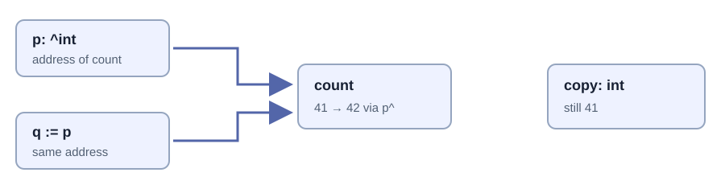

# Pointers and borrowed views

<a id="pointers"></a>

Chapter 10 · Identity, aliasing, and lifetime

## 10. Pointers, references, and borrowed views

Suppose a procedure changes a counter, but the caller still sees the old number. Your first instinct might be to “pass it by reference.” Before changing the declaration, ask what was actually copied. Was it the number? A pointer to the number? A slice header that points to many numbers? These are different values with different consequences.

The useful mental model is not “pointers are complicated integers.” A pointer names a location where a suitably typed object must still exist when you use it. Its type describes how to interpret that location; it does not establish who owns the object, how long it survives, or whether another procedure is using it at the same time. Those missing facts form the rest of the contract.

This chapter uses the language’s [pointer rules](https://odin-lang.org/docs/overview/#pointers) and the runtime shipped with `dev-2026-09-nightly:a2fb372`. Put each complete program below in its own directory as `main.odin`, then run `odin check .` and `odin run .`. Do not combine their `main` declarations. Deliberately invalid fragments are labeled separately; they are diagnostic exercises, not programs to execute.

### 1. A value, an address, and an object are three different things

In `count := 41`, the variable holds an integer value. `&count` takes the address of that variable. The address is a value too, with type `^int`. Reading `p^` accesses the integer at the address stored in `p`. Writing `p^ = 42` changes that integer, not the pointer’s address.

| Expression | Meaning | Does it allocate an object? |
| --- | --- | --- |
| `copy := count` | A separate integer variable initialized with the same value. | No allocator request is implied. |
| `p := &count` | A pointer value naming the existing variable. | No new integer is created. |
| `q := p` | A second pointer value naming the same integer. | No copy of the target is made. |
| `p^` | The target integer, accessed through `p`. | No ownership is transferred. |
| `p = &other` | Change which object `p` names. | The old target and `q` are unchanged. |

The caret occurs before the type in `^int` and after the expression in `p^`. This keeps the declaration and use distinct; it is not C’s `*` syntax with a cosmetic spelling change. Address-taking requires an addressable operand. A computed temporary such as `&(2 + 3)` is not a request to allocate a persistent integer.



Copying an address copies the relationship to the target. Copying an integer copies the integer. Neither operation is a recursive clone of an object graph.

[Open the precise SVG diagram](../assets/diagrams/pointer-aliases.svg). This memory illustration retains explicit positions rather than using automatic graph layout.

### 2. Passing a pointer is still passing a value

Odin procedure parameters are immutable values. A parameter of type `^int` receives a pointer value; its target may remain mutable. The parameter’s immutability does not spread through the pointer and freeze the integer. Conversely, a pointer parameter is not a reference to the caller’s pointer variable.

```odin
package main

import "core:fmt"

increment :: proc(target: ^int) -> bool {
    if target == nil { return false }
    target^ += 1
    return true
}

retarget :: proc(slot: ^^int, target: ^int) {
    slot^ = target
}

main :: proc() {
    count := 41
    copy := count
    p := &count
    q := p
    assert(increment(p))
    assert(count == 42 && q^ == 42 && copy == 41)

    other := 99
    p = &other
    assert(p^ == 99 && q^ == 42)
    retarget(&p, &count)
    assert(p == q)
    assert(!increment(nil))
    fmt.println("value copies, aliases, retargeting, and nil: checked")
}
```

Predict the values before running. `increment(p)` changes `count` because the copied address still names it. Assigning a new address to `p` leaves `q` alone. `retarget` needs `^^int` because it changes the *pointer slot* owned by the caller, not the integer target. `&p` is the address of a pointer variable; `slot^` is that variable.

The nil check is an API choice, not a universal pointer idiom. `increment` accepts absence and returns `false`. A different procedure could require a non-nil argument and document that precondition. What it must not do is silently claim that every pointer-shaped value is valid.

```odin
// Deliberately invalid fragment: inspect the compiler diagnostic.
bad_retarget :: proc(p: ^int, other: ^int) {
    p = other // p is an immutable procedure parameter.
}
```

Even if a language let that assignment change a local parameter copy, it would not change the caller’s pointer slot. The distinction is about which object is mutated, not just which spelling the compiler accepts. The [procedure overview](https://odin-lang.org/docs/overview/#procedures) also explains that the ABI may pass a large immutable value indirectly for efficiency. An ABI optimization does not change the source-language value semantics or grant the caller mutable reference semantics.

### 3. What does “reference” mean in Odin?

People use “reference” for several things: a C++ reference type, a Rust borrow, a pointer to mutable storage, or simply two values sharing the same target. Odin does not give an ordinary `^T` a Rust-style lifetime proof or C++’s distinct `T&` reference declaration. In this book, a *borrow* means access to storage someone else keeps alive. It is an ownership contract, not a new pointer type.

There are reference-like language conveniences, including by-reference range iteration. With `for &item in items`, updates to `item` update an element of the iterated collection. Ordinary `for item in items` obtains element values instead. This convenience does not give the element a longer lifetime or authorize resizing the backing container while using its element references.

```odin
// Fragment inside a procedure.
items := [3]int{1, 2, 3}
for item in items {
    _ = item // Reading a value does not update items.
}
for &item in items {
    item *= 2 // Updates the actual element.
}
assert(items == [3]int{2, 4, 6})
```

Use explicit pointers when a procedure must mutate an object, and use slices when a procedure needs a bounded range. Avoid saying “everything is passed by reference” merely because elements remain shared. That phrase erases the most useful distinction: the small value can be copied while the storage it names stays shared.

### 4. Struct copies stop at their fields

A struct with integer fields copies those integers. A struct with a pointer field copies an address. A struct with a slice field copies a header. There is no automatic traversal that discovers and duplicates every target. Such a traversal would also need an answer for cycles, shared identity, allocation policy, and error handling.

```odin
package main

import "core:fmt"

Record :: struct {
    count: int,
    values: []int,
    selected: ^int,
}

main :: proc() {
    backing := [3]int{10, 20, 30}
    a := Record{count = 3, values = backing[:], selected = &backing[1]}
    b := a
    b.count = 99
    b.values[0] = 7
    b.selected^ = 8
    assert(a.count == 3 && b.count == 99)
    assert(a.values[0] == 7 && backing[1] == 8)

    b.values = b.values[:1]
    assert(len(a.values) == 3 && len(b.values) == 1)
    fmt.println("separate headers, shared targets: checked")
}
```

The two `count` fields are independent. The `values` headers are independent too: shortening `b.values` does not shorten `a.values`. But their data pointers still name the same backing array, so an element mutation is visible through both. The `selected` field adds another route to the same data.

For a fixed array of these records, copying the array copies each record value, including its addresses and slice headers. It does not clone the pointed-to integers. “Arrays copy their elements” remains true; “all data reachable from those elements becomes independent” does not follow.

Read [runtime/core.odin](https://github.com/odin-lang/Odin/blob/a2fb372b76e81ef31fbbc8a2cf2b4fdf5ac6c924/base/runtime/core.odin): `Raw_Slice` stores a data pointer and length; `Raw_Dynamic_Array` additionally stores capacity and allocator. These implementation representations explain the sharing. They do not encode a borrow checker, reference count, or a recursively applied destructor.

### 5. A slice checks an index, not the history of its storage

A slice supplies the extent missing from a bare pointer. Under normal bounds checking, `view[i]` checks that `i` lies in the slice’s range. That is valuable, but separate from asking whether the range still refers to live memory. A dangling slice can have a plausible pointer and a correct-looking length.

Likewise, a subslice preserves access to part of the same allocation; it does not become a new allocation owner. If `owner` names an allocated slice, `middle := owner[1:3]` starts at an interior address. Deleting `middle` as though it were the original allocation can pass an invalid pointer or size to the allocator. Keep the original owner and release it with its original allocator.

Strings are another pointer-and-length value, but language strings are immutable byte sequences. A mutable byte slice does not become a safe independent string merely because you construct a string view of it. If the bytes are later overwritten or freed, the view’s contract is broken. Clone when independence is required, and distinguish a byte length from a Unicode character count.

### 6. Single pointers and multi-pointers solve different problems

`^T` names a single target accessed with `p^`. `[^]T` describes a C-like pointer to successive values and supports indexing without storing a length. It cannot be dereferenced with `p^`; use an index or a suitable conversion. The type does not mean “infinite array” or “the compiler knows the allocation size.”

```odin
package main

import "core:fmt"

main :: proc() {
    values := [3]int{10, 20, 30}
    p: [^]int = raw_data(values[:])
    assert(p[1] == 20) // We know this index is valid from values.
    view := p[:len(values)]
    view[2] = 99
    assert(values[2] == 99)
    fmt.println("multi-pointer plus trusted extent becomes a view")
}
```

`raw_data` extracts the backing address; it does not allocate, clone, or pin it. Creating `p[:n]` constructs a slice with a claimed length. The compiler cannot discover whether a foreign pointer actually covers `n` valid elements. Even where slice construction checks the order of low/high indices, that does not validate the foreign allocation’s extent.

For a C API returning pointer-plus-count, validate the count, multiplication overflow, element layout, alignment, and the pointer’s documented lifetime before constructing a view. A non-zero count with a nil pointer is not a usable range. A count in bytes is not automatically a count of elements. Passing a pointer to the wrong struct layout can be invalid even when the address is aligned and non-nil.

Odin does not let you write ordinary `p + 1` pointer arithmetic. Multi-pointer indexing and `core:mem` offset utilities support the cases that genuinely need it; removing the infix syntax does not remove the obligation to stay within valid storage. Prefer a slice at an Odin-facing API boundary when a known range is the real contract.

### 7. Nil, valid, and owned are independent questions

The zero value of a pointer is `nil`. Comparing a pointer with nil tells you that its address value is absent; it does not tell you whether a non-nil address is still live, properly aligned, or yours to free. A freed pointer does not automatically turn every alias into nil. Assigning `owner = nil` changes only that variable.

| Pointer state | May access the target? | May release it? |
| --- | --- | --- |
| Nil | No. | Follow the allocator/API’s nil-release contract. |
| Live borrowed pointer into another object | Only while the owner and mutation rules permit. | No, not merely because the address is non-nil. |
| Live allocation owner | Within its extent and synchronization contract. | Exactly once, using the matching release operation. |
| Stale non-nil pointer after free/reset/reallocation | No. | No second release. |

Never test a dangling pointer by dereferencing it to “see if it still works.” Reclaimed bytes can retain their old contents; another allocation may reuse the same address. A successful-looking read is not evidence that the lifetime is valid. A numeric address equal to an earlier address also does not prove object identity survived.

### 8. Returning a pointer does not extend a local lifetime

```odin
// Intentionally unsafe lifetime sketch. Do not run this.
bad_result :: proc() -> ^int {
    local := 42
    return &local
}
```

The local object belongs to the activation of `bad_result`. Odin does not promise to keep it alive by moving it to a garbage-collected heap because its address escaped. A compiler diagnostic, if one catches a particular case, is helpful but not a general static lifetime proof. Optimizations can change the manifestation of a misuse without changing the misuse itself.

The safe alternatives depend on the real requirement: return an integer value; accept caller-owned output storage; or allocate a result whose owner and allocator are explicit. Do not start with heap allocation when a small value return already solves the problem.

```odin
package main

import "core:fmt"
import "core:mem"

Counter :: struct { value: int }

create_counter :: proc(allocator: mem.Allocator) ->
    (result: ^Counter, err: mem.Allocator_Error) {
    result = new(Counter, allocator) or_return
    result.value = 42
    return
}

run :: proc() -> mem.Allocator_Error {
    allocator := context.allocator
    owner, err := create_counter(allocator)
    if err != nil { return err }
    defer free(owner, allocator)
    borrowed := owner
    borrowed.value += 1
    assert(owner.value == 43)
    fmt.println("one allocation owner; borrowed access ends before free")
    return nil
}

main :: proc() {
    err := run()
    assert(err == nil, "allocation failed in pointer example")
}
```

The field selector can follow a pointer to a struct, so `owner.value` reads a field in the pointed-to `Counter`. The procedure’s named results allow `or_return` to propagate allocation failure before dereferencing. The returned pointer owns a new allocation by this API’s documented contract, not by virtue of its `^Counter` type. `borrowed` must not be freed separately.

`new` requests zero-initialized storage in this runtime. The “stack versus heap” distinction alone is not enough: the supplied allocator could be an arena, so even allocated storage can have a short bulk-reset lifetime. The next chapter explains that policy choice.

### 9. Reallocation invalidates a relationship, not just an address

A dynamic array’s header may remain in a stable local variable while its element storage moves. A pointer to the header, `&items`, is not a pointer to an element, `&items[0]`. Appending can update the header to name a new allocation while an old element pointer still names reclaimed storage.

```odin
// Ownership sketch, not a complete program.
items := make([dynamic]int)
append(&items, 10)
old_element := &items[0]
append(&items, 20) // May grow/reallocate; do not rely on old_element.
// Reacquire &items[0] after operations that can move the storage.
```

In [core\_builtin.odin](https://github.com/odin-lang/Odin/blob/a2fb372b76e81ef31fbbc8a2cf2b4fdf5ac6c924/base/runtime/core_builtin.odin), the append path checks capacity and asks the allocator to resize before copying elements. Whether a particular allocator grows in place is an implementation outcome, not a caller-side lifetime guarantee. Reserving enough capacity can avoid a particular growth, but deletion, later reservation changes, and reordering still need their own reasoning.

Use indices when the container can move and an index remains a meaningful identity. An index is not automatically a stable handle either: removing or sorting elements changes what that position means. If the application needs identity across moves and deletion, design a handle with a checked validity rule rather than treating the old address as that rule.

### 10. Foreign pointers bring a foreign release contract

The libav chapters use `^rawptr` to model a C API that writes a handle through a pointer-to-pointer. The library may allocate the object internally, and its close function may also clear the caller’s handle. That does not make `free(handle)` through Odin’s default allocator correct. Match acquisition with the foreign API’s release procedure.

A `rawptr` loses the pointed-to type. A cast back to `^T` restores a type description for the compiler, not proof that the address actually contains a live `T`. Check the ABI, callback lifetime, alignment, and ownership contract. A C callback has no automatically supplied Odin context; code that enters Odin from a foreign convention must establish the appropriate context before invoking context-dependent procedures.

Also distinguish a pointer passed only for the duration of a call from one retained by the library. A C function that stores your callback data needs that data to survive future calls; handing it a pointer to a local record that soon goes out of scope breaks the contract. Foreign code is not obliged to understand your arena reset schedule.

### 11. Shared access needs a synchronization contract too

Two pointers to one live object establish possible aliasing, not thread safety. If concurrent procedures read and write that object without the required synchronization, a correct allocator and a correct lifetime do not make the program correct. Publishing a pointer also publishes whatever lifetime and mutation assumptions its consumer needs.

The simplest ownership rule is often one mutable owner, short borrowed access, and no container growth while a view is in use. That is a design discipline rather than a theorem enforced by the language. Odin provides useful types and runtime checks, but an ordinary pointer does not carry a unique-owner certificate.

### 12. Tests that distinguish copies from aliases

Save this complete package separately as `pointers_test.odin` and run `odin test .`. Each assertion rules out a different wrong mental model; none deliberately dereferences invalid memory.

```odin
package pointer_specs

import "core:testing"

@(test)
test_pointer_copy_shares_target :: proc(t: ^testing.T) {
    value := 1
    independent := value
    p := &value
    q := p
    q^ = 9
    testing.expect_value(t, value, 9)
    testing.expect_value(t, independent, 1)
}

@(test)
test_slice_headers_are_separate_but_elements_are_shared :: proc(t: ^testing.T) {
    backing := [3]int{1, 2, 3}
    a := backing[:]
    b := a[:1]
    b[0] = 7
    testing.expect_value(t, len(a), 3)
    testing.expect_value(t, len(b), 1)
    testing.expect_value(t, a[0], 7)
}

@(test)
test_retargeting_one_pointer_leaves_the_other :: proc(t: ^testing.T) {
    first, second := 1, 2
    p := &first
    q := p
    p = &second
    testing.expect_value(t, p^, 2)
    testing.expect_value(t, q^, 1)
}

@(test)
test_multi_pointer_view_borrows_array :: proc(t: ^testing.T) {
    backing := [2]int{4, 5}
    p := raw_data(backing[:])
    view := p[:len(backing)]
    view[1] = 8
    testing.expect_value(t, backing[1], 8)
}

@(test)
test_reference_iteration_mutates_elements :: proc(t: ^testing.T) {
    backing := [3]int{1, 2, 3}
    for &item in backing { item *= 2 }
    testing.expect_value(t, backing, [3]int{2, 4, 6})
}
```

**Exercise 10.1 · Explain every arrow.** Extend `Record` with a fixed array and another slice. Copy the record, mutate one field of each kind, and predict exactly which observations change. Draw storage boxes separately from header values.

**Exercise 10.2 · Choose the lifetime, then the interface.** A procedure must provide a three-byte preview to its caller. Design a borrowed return, a caller-buffer version, and an allocated independent copy. State who releases storage in each version and whether another read may overwrite it. Pick the simplest interface that satisfies a stated use case.

**Exercise 10.3 · Diagnose without invoking a dangling read.** Compile separate fragments for assigning an immutable pointer parameter, writing `p + 1`, and dereferencing a multi-pointer with `p^`. Record the rejection. Then audit an append loop on paper: mark the last valid use of every element pointer before a possible resize.

**Checkpoint.** For any address or view, answer five questions: what object does it name, what is its valid extent, who keeps it alive, what can invalidate it, and who may mutate it? If your answer is only “it is non-nil,” the contract is incomplete.

Continue with [Chapter 11: why Odin gives you these lifetime decisions instead of hiding them](memory-philosophy.md#memory-philosophy).
