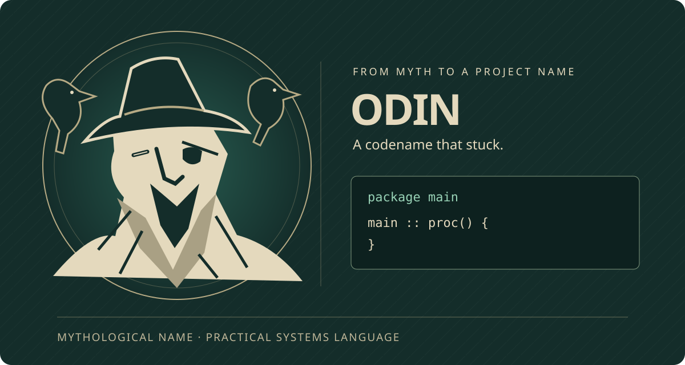

# Odin in Practice

*A practical, source-guided book for learning by building.*

{ .cover-art }

Why Odin? Ginger Bill [explains that it was a mythological project codename that stuck](https://forum.odin-lang.org/t/origin-of-the-name-odin/794). The cover illustrates that origin; it does not claim that the god’s attributes determined the language’s design.

How much does copying a slice copy? Which allocator does deletion use? Why can a successful child process still return an unusable result? Learn Odin by predicting behavior, reading the implementation, and testing the assumptions—with Linux command-line tools and FFmpeg as the working laboratory.

**The promise:** by the end, you will be able to reason about Odin packages, polymorphic procedures, allocators, byte layouts and foreign calls; design a CLI that composes with Unix; invoke FFmpeg tools without a shell; and explain the libav demux → packet → decoder → frame → filter/encoder → mux pipeline, its ownership rules and its send/receive state machine.

This is a working learning text, not a language or FFmpeg specification. Examples target Linux and were checked with Odin's official monthly `dev-2026-10` release (the compiler reports `dev-2026-10-nightly:84bc3fc`) and FFmpeg 6.x libraries. Both projects evolve: use the headers, documentation and source matching the libraries actually installed on your machine.

**Offline reader:** open the repository’s prebuilt `html/index.html`, or [download and extract the reader ZIP](https://weima.github.io/odin-in-practice/odin-in-practice-offline.zip). The prose, local assets, diagrams, companions, and skill download need no internet connection. Search may require a local HTTP server; external references need the internet. Markdown remains the editable source.

## How to read this book

This book assumes you can already program, read a shell command, and understand basic compilation. Each chapter starts with a practical question, builds the smallest useful model, then challenges it with a boundary case. Source walkthroughs explain mechanisms rather than asking you to memorize function bodies.

Read in order for the complete path, or follow the chapter links to revisit a boundary. Before running an example, predict the result. When your prediction fails, find the assumption that failed. The exercise is not complete until you can explain the observation without relying on the output being familiar.

**Reading the source without overclaiming:** implementation passages use the libraries shipped with this edition’s compiler, with links pinned to its [upstream commit](https://github.com/odin-lang/Odin/commit/84bc3fc2100b0f7880a3af37f71bccdcda41c6f9). Language rules, API promises, and implementation observations are labeled separately. [Chapter 31](chapters/workbook.md#sources) maps questions to the exact source paths and symbols.

The loop

### Read → run → change → explain

Save one example as `main.odin`, run the exact command, observe the output, and make one deliberate change. Compiler errors are part of the lesson.

A useful habit

### Keep the smallest repro

When a program surprises you, remove unrelated code until the surprise remains. A tiny program teaches faster than a large project.

Working system

### Examples target Linux

The language examples are Odin. The shell commands assume a Linux terminal. Sections using `/proc` are Linux-specific.

## Book contents

Choose a part or jump to a chapter. Pages use local relative links and work offline without JavaScript or a web server.

Odin foundations

### [Odin foundations](chapters/odin-foundations.md)

- [1. Prepare your workshop](chapters/odin-foundations.md#setup)
- [2. Packages, compilation, and targets](chapters/odin-foundations.md#first-program)
- [3. Read Odin: declarations and types](chapters/odin-foundations.md#syntax)
- [4. Procedures, control flow, and data](chapters/odin-foundations.md#procedures)
- [Interlude. Compile-time choices, data layout, and the C boundary](chapters/odin-foundations.md#advanced-odin)
- [Design decisions: data first, explicit flow](chapters/odin-foundations.md#design-decisions)

CLI, memory and systems

### [CLI and Linux](chapters/cli-linux.md)

- [5. The command-line contract](chapters/cli-linux.md#cli-contract)
- [6. Arguments and a first useful tool](chapters/cli-linux.md#arguments)
- [7. A real flag parser](chapters/cli-linux.md#flags)
- [8. Errors, cleanup, and ownership](chapters/cli-linux.md#errors)
- [9. Memory and allocators](chapters/cli-linux.md#memory)
- [10. Pointers, aliases, and borrowed views](chapters/pointers.md#pointers)
- [11. Memory and error philosophy](chapters/memory-philosophy.md#memory-philosophy)
- [12. Files are bytes](chapters/cli-linux.md#files)
- [13. Streams, pipes, and bounded work](chapters/cli-linux.md#streams)
- [13a. Text processing: exact, bounded, and syntax-aware](chapters/cli-linux.md#text-processing)
- [14. Environment and process context](chapters/cli-linux.md#environment)
- [15. Starting child processes](chapters/cli-linux.md#child-process)
- [16. Linux as a systems-programming lab](chapters/cli-linux.md#linux)
- [17. Network programming and an HTTP client](chapters/networking.md#networking)
- [17a. Watch worker activity with local IPC](chapters/activity.md#worker-activity)
- [18. Explore local Docker networks and filesystems](chapters/containers.md#containers)
- [19. Parallel programming](chapters/parallel-programming.md#parallel-programming)
- [20. Build, test, debug, and inspect](chapters/cli-linux.md#testing)
- [21. Tests as executable specifications](chapters/cli-linux.md#testing-specs)
- [22. Capstone: a composing file inspector](chapters/cli-linux.md#capstone)

FFmpeg and libav

### [FFmpeg and libav](chapters/ffmpeg-libav.md)

- [23. FFmpeg and ffprobe from the command line](chapters/ffmpeg-libav.md#ffmpeg-cli)
- [24. Compose ffprobe with Odin](chapters/ffmpeg-libav.md#odin-ffprobe)
- [25. How the libav libraries fit together](chapters/ffmpeg-libav.md#libav-model)
- [26. A real Odin-to-libav binding](chapters/ffmpeg-libav.md#libav-probe)
- [27. Decoding is a send/receive state machine](chapters/ffmpeg-libav.md#libav-decode)
- [28. Encoding, ownership, timestamps, and design choices](chapters/ffmpeg-libav.md#libav-design)

Optional workbook and references

### [Workbook and references](chapters/workbook.md)

- [29. Workbook: exercises and solutions](chapters/workbook.md#workbook)
- [30. Pocket glossary](chapters/workbook.md#glossary)
- [31. Official references and source trail](chapters/workbook.md#sources)

Downloadable companion

### Make the Odin skill your own

[Download the companion skill folder as a ZIP](skills/odin-companion.zip), including its local reference checklist. Read the [usage and customization instructions](skills/odin-companion/README.md). Adapt it with your preferred skill-creation tool; no global installation or private machine configuration is required.
